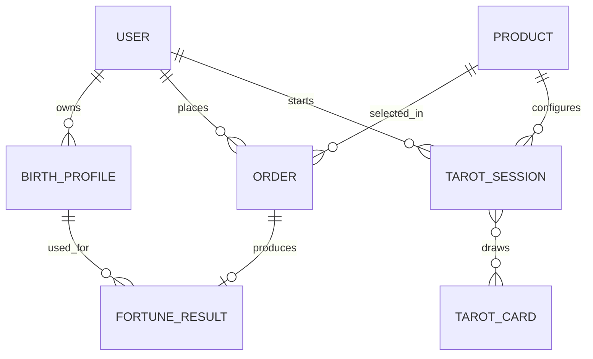

# 청월당 사주·타로 역기획서 템플릿

> 전체 항목을 검토하는 참조용 템플릿이다. 실제 작성과 원본 관리는 [다중 파일 문서 맵](cheongwoldang/INDEX.md)을 따른다. 아래 예시 흐름·관계도는 관찰 사실이 아니며 실제 서비스 동작을 사전 확정하지 않는다.

| 문서 메타데이터 | 값 |
| --- | --- |
| 문서 상태 | 조사 전 / 조사 중 / 검토 중 / 완료 |
| 조사 기준일 | YYYY-MM-DD |
| 분석 대상 | <https://cheongwoldang.com/> |
| 분석 범위 | 사주·운세 및 타로 기능 |
| 템플릿 버전 | 1.2 |
| 사실 원본 | [청월당 사주·타로 팩트북](cheongwoldang-saju-tarot.factbook.template.md) |
| 작성자 | {작성자} |

## 0. 문서 사용 규칙

### 증거 등급

| 등급 | 의미 | 작성 예시 |
| --- | --- | --- |
| 확인 | 실제 화면이나 동작으로 직접 확인 | `[확인] 비회원도 상품 상세 화면을 볼 수 있다.` |
| 추론 | 여러 화면과 동작을 근거로 합리적으로 도출 | `[추론] 연령과 성별이 추천에 사용된다.` |
| 가설 | 내부 구현을 설명하기 위한 검증 전 가정 | `[가설] 결과 본문은 템플릿과 생성형 AI를 함께 사용한다.` |
| 미확인 | 접근 제한이나 조사 범위 때문에 확인하지 못함 | `[미확인] 결제 실패 후 재시도 정책` |

### 작성 원칙

- 모든 주요 주장에는 증거 등급을 표시한다.
- 직접 관찰한 사실은 역기획서에 중복 저장하지 않고 팩트북의 Fact ID를 참조한다.
- 화면 문구는 필요한 만큼만 인용하고 화면의 목적과 규칙을 설명한다.
- 동일한 사실을 여러 절에 복사하지 않고 기준 절을 링크한다.
- 추론과 가설에는 근거, 대안 설명, 확인 방법을 함께 기록한다.
- 사주와 타로는 공통 플랫폼과 개별 도메인으로 나누어 작성한다.
- 최신 트렌드는 조사 기준일, 출처, 시장, 관찰 기간을 함께 기록한다.
- 요구사항은 화면, 비즈니스 규칙, 데이터, 완료 기준까지 추적 가능해야 한다.
- 범위 내 실제 화면과 동작의 전수 조사가 끝나기 전에는 역기획 본문을 작성하지 않는다.
- 접근할 수 없는 동작은 누락하지 않고 차단 사유, 필요한 권한, 대체 검증 방법을 기록한다.
- 조사 중 발견한 범위 밖 기능은 본문에 확장하지 않고 부록에 기록한다.

### 역기획 작성 순서

```text
범위 고정
  -> 화면·URL 전수 발견
  -> 화면별 인터랙션 전수 실행
  -> 사용자 상태·정상·오류·이탈·재진입 상태 확인
  -> 팩트북 기록 완료
  -> 화면·행동 커버리지 감사
  -> 조사 완료 게이트 통과
  -> 역기획 본문 작성
  -> 요구사항·인수 기준 도출
```

### 역기획 작성 개시 게이트

다음 항목이 모두 충족되기 전에는 4절 이후의 분석 내용을 작성하지 않는다.

- [ ] 범위 내 진입점, 화면, URL 패턴이 화면 인벤토리에 모두 등록되었다.
- [ ] 각 화면의 링크, 버튼, 탭, 캐러셀, 입력, 선택, 스크롤, 뒤로가기 동작을 확인했다.
- [ ] 비회원·회원 및 이용 가능한 구매 상태별 차이를 확인했다.
- [ ] 기본·로딩·완료·빈 상태·오류·중단·재진입 상태를 확인했다.
- [ ] 사주 입력·결과 흐름과 타로 질문·카드 선택·결과 흐름을 끝까지 확인했다.
- [ ] 결제·개인정보 제출처럼 별도 승인이 필요한 동작은 승인 여부와 차단 범위를 기록했다.
- [ ] 모든 확인 결과가 화면·행동 커버리지 표와 증거 로그에 연결되었다.
- [ ] 모든 확인 사실이 팩트북의 Fact ID 또는 화면 캡처와 연결되었다.
- [ ] 미확인 항목이 없거나, 불가피한 차단 항목을 사용자가 명시적으로 수용했다.

### 템플릿 완료 조건

- 사주와 타로의 사용자 여정, 입력, 결과, 상품 정책이 각각 정의되어 있다.
- 조사 완료 게이트가 통과 상태이고 화면·행동 커버리지에 미분류 항목이 없다.
- 공통 기능과 도메인별 기능의 경계가 명확하다.
- UI, 이미지, 캐릭터 트렌드가 출처와 함께 분석되어 있다.
- 모든 핵심 기능이 구현 요구사항과 인수 기준으로 연결되어 있다.
- 미확인 사항이 사실처럼 작성되지 않고 후속 조사 목록에 남아 있다.

## 1. 요약

### 1.1 한 줄 정의

{청월당의 사주와 타로 기능이 누구의 어떤 문제를 어떤 방식으로 해결하는지 한 문장으로 작성}

### 1.2 핵심 가치

| 대상 사용자 | 해결하려는 문제 | 제공 가치 | 대표 기능 |
| --- | --- | --- | --- |
| {사용자군} | {문제} | {가치} | {기능} |

### 1.3 핵심 발견

1. {발견 사항}
2. {발견 사항}
3. {발견 사항}

### 1.4 도메인별 핵심 비즈니스 구조

```text
공통: {유입} -> {상품 탐색} -> {무료 경험 또는 미리보기} -> {구매} -> {결과 열람} -> {재방문}
사주: {생년월일시 입력} -> {명리 기반 해석} -> {주제별 결과}
타로: {질문·주제 선택} -> {카드 선택 또는 스프레드} -> {카드 조합 해석}
```

## 2. 분석 범위

### 2.1 포함: 사주

- 오늘의 운세
- 무료 사주 콘텐츠
- 유료 사주 상품과 상품 탐색
- 사주정보 입력과 검증
- 결과 생성·열람·보관
- 결제 및 구매 완료
- 사주 기능에 필요한 로그인·회원 상태
- 개인화 추천과 재방문 흐름

### 2.2 포함: 타로

- 무료·유료 타로 콘텐츠
- 질문과 주제 선택
- 카드 선택 및 스프레드 진행
- 카드 공개와 조합 해석
- 결과 생성·열람·보관
- 타로 상품 탐색, 추천, 결제, 재방문 흐름

### 2.3 포함: 공통 플랫폼

- 홈·검색·카테고리·상품 상세·보관함의 사주·타로 접점
- 회원 상태, 인물 프로필, 주문, 결제, 결과 저장
- 상품·콘텐츠 운영에 필요한 관리 요구사항
- UI, 이미지, 일러스트, 캐릭터 표현과 최신 트렌드
- 분석 이벤트, KPI, 오류와 예외 처리

### 2.4 제외

- 자미두수
- 꿈해몽
- 관상·손금·풍수
- 작명·이름풀이
- 부적·심리테스트
- 사주 매거진의 콘텐츠 전략
- 운영자용 백오피스의 상세 화면 설계

### 2.5 경계 규칙

{포함 기능과 제외 기능이 공통 컴포넌트나 정책을 사용할 때 어느 수준까지 분석할지 작성}

## 3. 조사 방법과 제약

### 3.1 조사 환경

| 항목 | 내용 |
| --- | --- |
| 기기·화면 | {모바일/데스크톱, 화면 크기} |
| 브라우저 | {브라우저·버전·세션} |
| 로그인 상태 | {비회원/회원} |
| 계정 조건 | {신규/기존 구매 이력 등} |
| 조사 기간 | {시작일~종료일} |
| 실행하지 않은 행동 | {실결제, 개인정보 제출 등} |

### 3.2 제약과 영향

| 제약 | 분석에 미치는 영향 | 보완 방법 |
| --- | --- | --- |
| {제약} | {영향} | {보완 방법} |

### 3.3 트렌드 조사 기준

| 항목 | 기준 |
| --- | --- |
| 조사 기준일 | {YYYY-MM-DD} |
| 관찰 기간 | {최근 12~24개월 등} |
| 대상 시장 | {한국/글로벌, 모바일 웹/앱 등} |
| 비교 서비스 선정 기준 | {직접 경쟁/간접 경쟁/콘텐츠 커머스 등} |
| 출처 원칙 | {공식 서비스, 디자인 시스템, 리서치 보고서 등} |
| 최신성 판정 | {게시일·업데이트일·현재 서비스 반영 여부} |

### 3.4 조사 산출물 추적

| 산출물 | 근거 위치 | 완료 조건 |
| --- | --- | --- |
| 기능·화면 인벤토리 | {절/부록} | {기준} |
| 사주·타로 사용자 여정 | {절/부록} | {기준} |
| 시각 트렌드 분석 | {절/부록} | {기준} |
| 개발 요구사항 | {절/부록} | {기준} |

### 3.5 실제 화면·동작 전수 조사 프로토콜

| 단계 | 조사 대상 | 필수 확인 항목 | 기록 위치 | 완료 조건 |
| --- | --- | --- | --- | --- |
| 1. 발견 | 내비게이션·검색·딥링크 | 모든 진입점과 URL 패턴 | 화면 인벤토리 | 신규 화면이 더 이상 발견되지 않음 |
| 2. 정적 상태 | 각 화면 | 텍스트·이미지·캐릭터·가격·CTA·권한 | 화면별 UX | 주요 영역이 증거와 연결됨 |
| 3. 상호작용 | 모든 조작 요소 | 클릭·입력·선택·스와이프·스크롤·뒤로가기 | 행동 커버리지 | 모든 요소가 확인·차단·범위 제외로 분류됨 |
| 4. 상태 전이 | 각 상호작용 | 전후 URL·화면·데이터·토스트·모달·저장 상태 | 상태 전이표 | 시작·종료·실패 상태가 기록됨 |
| 5. 조건 차이 | 사용자·상품 상태 | 로그인·구매·프로필·무료/유료 차이 | 상태별 비교표 | 정의된 조건 조합이 모두 확인됨 |
| 6. 복구 | 실패·중단·재진입 | 새로고침·뒤로가기·재시도·다른 기기·보관함 | 예외 시나리오 | 복구 가능 여부가 기록됨 |
| 7. 감사 | 전체 범위 | 누락·중복·상충·증거 없는 주장 | 커버리지 감사 | 조사 완료 게이트 통과 |

### 3.6 조사 상태 정의

| 상태 | 정의 | 역기획 근거 사용 |
| --- | --- | --- |
| 확인 | 실제 조작과 전후 상태를 확인하고 증거를 남김 | 가능 |
| 차단 | 권한·결제·개인정보·기술 문제로 실행하지 못했으며 사유를 기록 | 제한적으로 가능 |
| 범위 제외 | 합의된 사주·타로 범위 밖 동작 | 불가 |
| 미조사 | 아직 실행하지 않은 동작 | 불가 |

### 3.7 화면·행동 커버리지 요약

| 도메인 | 발견 화면 | 확인 완료 | 차단 | 범위 제외 | 미조사 | 커버리지 | 게이트 |
| --- | ---: | ---: | ---: | ---: | ---: | ---: | --- |
| 공통 | {수} | {수} | {수} | {수} | {수} | {비율} | {통과/실패} |
| 사주 | {수} | {수} | {수} | {수} | {수} | {비율} | {통과/실패} |
| 타로 | {수} | {수} | {수} | {수} | {수} | {비율} | {통과/실패} |

## 4. 사용자와 이용 맥락

### 4.1 핵심 사용자군

| 사용자군 | 상황 | 주요 욕구 | 우려 | 성공 기준 |
| --- | --- | --- | --- | --- |
| {사용자군} | {상황} | {욕구} | {우려} | {기준} |

### 4.2 핵심 이용 과업

| Job ID | 사용자는 언제 | 무엇을 알고 싶어 하며 | 어떤 결과를 기대하는가 |
| --- | --- | --- | --- |
| JOB-01 | {상황} | {질문} | {기대 결과} |

## 5. 시장·UI·이미지·캐릭터 트렌드

### 5.1 비교 서비스 구성

| 비교군 ID | 서비스·브랜드 | 시장 | 비교 이유 | 관찰 채널 | 조사 기준일 | 출처 |
| --- | --- | --- | --- | --- | --- | --- |
| BM-01 | {서비스} | {한국/글로벌} | {이유} | {웹/앱/SNS/캠페인} | YYYY-MM-DD | {URL} |

### 5.2 트렌드 신호 판정

| 신호 ID | 관찰 패턴 | 반복 관찰된 서비스 | 등장 시기 | 지속성 | 청월당 적용 여부 | 근거 |
| --- | --- | --- | --- | --- | --- | --- |
| TR-01 | {패턴} | {서비스 목록} | {시기} | {단기/성장/정착} | {적용/부분/미적용} | {증거 ID} |

### 5.3 UI 트렌드

| 영역 | 현재 트렌드 | 사용자 효과 | 전환 효과 | 구현 영향 | 청월당 관찰 | 판단 |
| --- | --- | --- | --- | --- | --- | --- |
| 탐색·내비게이션 | {트렌드} | {효과} | {효과} | {영향} | {관찰} | {선도/동등/후행/상이} |
| 카드·목록 | {트렌드} | {효과} | {효과} | {영향} | {관찰} | {판단} |
| 입력 플로우 | {트렌드} | {효과} | {효과} | {영향} | {관찰} | {판단} |
| 결과 스토리텔링 | {트렌드} | {효과} | {효과} | {영향} | {관찰} | {판단} |
| 결제·잠금 해제 | {트렌드} | {효과} | {효과} | {영향} | {관찰} | {판단} |
| 재방문 장치 | {트렌드} | {효과} | {효과} | {영향} | {관찰} | {판단} |

### 5.4 이미지·일러스트 트렌드

| 요소 | 스타일 특성 | 감정·브랜드 역할 | 제작 방식 추정 | 확장성 | 리스크 | 근거 |
| --- | --- | --- | --- | --- | --- | --- |
| 메인 비주얼 | {특성} | {역할} | {2D/3D/생성형/촬영 등} | {평가} | {저작권/일관성 등} | {증거 ID} |
| 상품 썸네일 | {특성} | {역할} | {방식} | {평가} | {리스크} | {증거 ID} |
| 결과 삽화 | {특성} | {역할} | {방식} | {평가} | {리스크} | {증거 ID} |
| 모션·전환 | {특성} | {역할} | {방식} | {평가} | {리스크} | {증거 ID} |

### 5.5 캐릭터 트렌드와 역할

| 캐릭터 ID | 역할·페르소나 | 외형 코드 | 말투 | 담당 상품·주제 | 신뢰 형성 방식 | 확장 가능성 | 근거 |
| --- | --- | --- | --- | --- | --- | --- | --- |
| CH-01 | {점술가/가이드 등} | {복식·색·소품} | {톤} | {영역} | {전문성/친밀감 등} | {콘텐츠/IP/커머스} | {증거 ID} |

### 5.6 시각 시스템 명세로의 전환

| 결정 ID | 관찰·트렌드 | 채택 여부 | 제품 원칙 | 구현·에셋 요구사항 | 검증 방법 |
| --- | --- | --- | --- | --- | --- |
| VD-01 | {관찰} | {채택/변형/배제} | {원칙} | {컴포넌트·이미지·캐릭터 요구} | {방법} |

## 6. 정보 구조와 기능 인벤토리

### 6.1 정보 구조

```text
{공통 플랫폼}
├── {사주}
│   ├── {무료·오늘의 운세}
│   └── {유료 상품·입력·결과}
├── {타로}
│   ├── {무료 타로}
│   └── {유료 상품·질문·카드 선택·결과}
└── {공통: 탐색·회원·결제·보관}
```

> 실제 조사 결과에 맞춰 구조를 수정한다.

### 6.2 기능 인벤토리

| 기능 ID | 도메인 | 기능 | 진입점 | 대상 사용자 | 무료/유료 | 입력 | 출력 | 로그인 | 상태 |
| --- | --- | --- | --- | --- | --- | --- | --- | --- | --- |
| FT-001 | {공통/사주/타로} | {기능} | {진입점} | {사용자} | {구분} | {입력} | {출력} | {필요 여부} | {확인/추론/미확인} |

### 6.3 화면 인벤토리

| 화면 ID | 도메인 | 화면명 | URL 패턴 | 목적 | 주요 CTA | 선행 화면 | 후속 화면 | 조사 상태 |
| --- | --- | --- | --- | --- | --- | --- | --- | --- |
| SC-001 | {공통/사주/타로} | {화면명} | `{URL}` | {목적} | {CTA} | {화면} | {화면} | {상태} |

## 7. 핵심 사용자 여정

### 7.1 여정 목록

| 여정 ID | 시나리오 | 시작 조건 | 완료 조건 | 수익 연관성 |
| --- | --- | --- | --- | --- |
| JR-S01 | 사주 무료·오늘의 운세 이용 | {조건} | {조건} | {직접/간접/없음} |
| JR-S02 | 유료 사주 구매와 결과 열람 | {조건} | {조건} | {직접} |
| JR-T01 | 무료 타로 질문과 카드 선택 | {조건} | {조건} | {직접/간접/없음} |
| JR-T02 | 유료 타로 구매와 결과 열람 | {조건} | {조건} | {직접} |
| JR-C01 | 구매 결과 재열람 | {조건} | {조건} | {간접} |

### 7.2 여정 상세

#### JR-{NN}: {여정명}

```mermaid
flowchart LR
    A[{시작}] --> B[{탐색}]
    B --> C[{입력}]
    C --> D[{결제 또는 결과 생성}]
    D --> E[{결과 열람}]
```

| 단계 | 사용자 행동 | 화면·시스템 반응 | 요구 정보 | 주요 CTA | 이탈 요인 | 전환 장치 | 근거 |
| --- | --- | --- | --- | --- | --- | --- | --- |
| 1 | {행동} | {반응} | {정보} | {CTA} | {요인} | {장치} | {증거 ID} |

## 8. 화면별 UX 역기획

> 아래 블록을 각 핵심 화면에 반복한다.

### SC-{NNN}: {화면명}

- URL: `{URL 또는 패턴}`
- 화면 목적: {목적}
- 진입 조건: {조건}
- 이탈·종료 조건: {조건}
- 연결 여정: {JR ID}

#### 정보 우선순위

1. {가장 중요한 정보}
2. {다음 정보}
3. {보조 정보}

#### 구성 요소

| 영역 | 요소 | 사용자에게 주는 정보 | 기대 행동 | 노출 조건 | 상태 |
| --- | --- | --- | --- | --- | --- |
| {영역} | {요소} | {정보} | {행동} | {조건} | {기본/로딩/오류/빈 상태} |

#### UX 장치

| 유형 | 관찰 내용 | 의도 추론 | 근거 |
| --- | --- | --- | --- |
| 신뢰 | {리뷰, 순위, 브랜드 등} | {의도} | {증거 ID} |
| 전환 | {미리보기, 할인, CTA 등} | {의도} | {증거 ID} |
| 재방문 | {보관, 알림, 오늘의 운세 등} | {의도} | {증거 ID} |

#### 예외 상태

| 상태 | 발생 조건 | 사용자 안내 | 복구 행동 | 확인 여부 |
| --- | --- | --- | --- | --- |
| {오류/빈 상태 등} | {조건} | {문구·표현} | {행동} | {등급} |

## 9. 사주·타로 입력 설계

### 9.1 공통 입력 원칙

| 원칙 ID | 원칙 | 적용 도메인 | 사용자 이유 | 비즈니스 이유 | 구현 영향 |
| --- | --- | --- | --- | --- | --- |
| IP-01 | {원칙} | {공통/사주/타로} | {이유} | {이유} | {영향} |

### 9.2 사주 입력 데이터

| 필드 ID | 필드 | 형식 | 필수 | 기본값 | 검증 규칙 | 저장·재사용 | 사용 목적 | 근거 |
| --- | --- | --- | --- | --- | --- | --- | --- | --- |
| IN-S01 | {필드} | {형식} | {Y/N} | {값} | {규칙} | {정책} | {목적} | {증거 ID} |

### 9.3 타로 질문·카드 선택 데이터

| 필드 ID | 필드·행동 | 형식 | 필수 | 선택 제약 | 결과에 미치는 영향 | 저장·재사용 | 근거 |
| --- | --- | --- | --- | --- | --- | --- | --- |
| IN-T01 | {질문/주제/카드/스프레드 등} | {형식} | {Y/N} | {제약} | {영향} | {정책} | {증거 ID} |

### 9.4 입력 단계

| 도메인 | 순서 | 단계 | 입력·선택 | 안내 정보 | 다음 단계 조건 | 이탈 복구 |
| --- | --- | --- | --- | --- | --- | --- |
| {사주/타로} | 1 | {단계} | {입력·선택} | {안내} | {조건} | {복구 방식} |

### 9.5 검증 및 예외

| 규칙 ID | 도메인 | 조건 | 기대 동작 | 사용자 메시지 | 확인 여부 |
| --- | --- | --- | --- | --- | --- |
| IV-01 | {공통/사주/타로} | {조건} | {동작} | {메시지} | {등급} |

## 10. 사주·타로 결과 설계

### 10.1 도메인별 결과 구조

| 도메인 | 순서 | 결과 섹션 | 핵심 질문 | 개인화 입력 | 무료 공개 | 잠금 여부 | 다음 행동 |
| --- | --- | --- | --- | --- | --- | --- | --- |
| {사주/타로} | 1 | {섹션} | {질문} | {입력} | {범위} | {Y/N} | {CTA} |

### 10.2 사주 생성 구조 가설

```text
{생년월일시·성별·관계 정보}
  -> {명리 계산 또는 규칙 처리}
  -> {사용자 유형·상품별 분기}
  -> {콘텐츠 템플릿 또는 생성 모델}
  -> {후처리·안전 규칙}
  -> {결과 저장과 렌더링}
```

### 10.3 타로 생성 구조 가설

```text
{질문·주제·스프레드·선택 카드}
  -> {카드 정·역방향과 위치 의미}
  -> {카드 조합·질문 맥락 해석}
  -> {콘텐츠 템플릿 또는 생성 모델}
  -> {후처리·안전 규칙}
  -> {결과 저장과 렌더링}
```

| 가설 ID | 가설 | 관찰 근거 | 대안 설명 | 확인 방법 | 신뢰도 |
| --- | --- | --- | --- | --- | --- |
| HY-01 | {가설} | {증거 ID} | {대안} | {방법} | {상/중/하} |

### 10.4 결과 콘텐츠 계약

| 계약 ID | 도메인 | 콘텐츠 단위 | 필수 데이터 | 길이·형식 | 금지·주의 표현 | 실패 시 처리 |
| --- | --- | --- | --- | --- | --- | --- |
| CT-01 | {사주/타로} | {제목/요약/상세/조언 등} | {데이터} | {형식} | {정책} | {처리} |

### 10.5 결과 품질 기준

| 기준 | 관찰 지표 | 기대 수준 | 비고 |
| --- | --- | --- | --- |
| 개인화 | {사용자 입력 반영 정도} | {수준} | {비고} |
| 일관성 | {섹션 간 모순 여부} | {수준} | {비고} |
| 가독성 | {분량·구조·강조} | {수준} | {비고} |
| 안전성 | {과도한 단정·민감 주제 처리} | {수준} | {비고} |

## 11. 상품과 수익 구조

### 11.1 상품 체계

| 상품 ID | 도메인 | 상품명 | 주제 | 대상 | 가격 | 할인 | 결과 분량 | 차별점 | 근거 |
| --- | --- | --- | --- | --- | --- | --- | --- | --- | --- |
| PR-001 | {사주/타로} | {상품명} | {주제} | {대상} | {가격} | {할인} | {분량} | {차별점} | {증거 ID} |

### 11.2 무료·유료 경계

| 접점 | 무료 제공 가치 | 유료 전환 장치 | 잠금 기준 | 전환 후 가치 |
| --- | --- | --- | --- | --- |
| {접점} | {가치} | {장치} | {기준} | {가치} |

### 11.3 결제 흐름

```text
상품 선택 -> 사주정보 확인 -> 주문 확인 -> 결제 -> 결과 생성 -> 결과 열람·보관
```

| 단계 | 사용자 행동 | 시스템 상태 | 실패 조건 | 복구 방식 | 확인 여부 |
| --- | --- | --- | --- | --- | --- |
| {단계} | {행동} | {상태} | {조건} | {복구} | {등급} |

### 11.4 정책

| 정책 ID | 항목 | 관찰된 정책 | 노출 위치 | 미확인 사항 |
| --- | --- | --- | --- | --- |
| PO-01 | 결과 이용 기간 | {정책} | {위치} | {사항} |
| PO-02 | 환불 | {정책} | {위치} | {사항} |
| PO-03 | 재생성 | {정책} | {위치} | {사항} |

## 12. 개인화와 추천

### 12.1 추천 접점

| 접점 ID | 화면 | 추천 대상 | 사용 신호 추정 | 정렬·노출 규칙 | 목표 | 근거 |
| --- | --- | --- | --- | --- | --- | --- |
| RC-01 | {화면} | {상품/콘텐츠} | {신호} | {규칙} | {목표} | {증거 ID} |

### 12.2 사용자 상태별 차이

| 상태 | 사용 가능한 신호 | 예상 추천 방식 | 확인 방법 |
| --- | --- | --- | --- |
| 비회원 | {신호} | {방식} | {방법} |
| 신규 회원 | {신호} | {방식} | {방법} |
| 기존 구매자 | {신호} | {방식} | {방법} |

## 13. 비즈니스 규칙과 상태

### 13.1 비즈니스 규칙

| 규칙 ID | 도메인 | 규칙 | 적용 범위 | 예외 | 근거 등급 | 증거 |
| --- | --- | --- | --- | --- | --- | --- |
| BR-001 | {공통/사주/타로} | {항상 참이어야 하는 규칙} | {범위} | {예외} | {등급} | {증거 ID} |

### 13.2 사용자·주문·결과 상태

| 대상 | 상태 | 진입 조건 | 허용 행동 | 다음 상태 |
| --- | --- | --- | --- | --- |
| 사용자 | {비회원/회원 등} | {조건} | {행동} | {상태} |
| 주문 | {대기/완료/실패 등} | {조건} | {행동} | {상태} |
| 결과 | {미생성/생성 중/완료/실패 등} | {조건} | {행동} | {상태} |

## 14. 데이터 모델 가설

### 14.1 핵심 엔터티

| 엔터티 | 역할 | 주요 속성 | 관계 | 민감도 | 근거 등급 |
| --- | --- | --- | --- | --- | --- |
| User | {역할} | {속성} | {관계} | {수준} | {등급} |
| BirthProfile | {역할} | {속성} | {관계} | {수준} | {등급} |
| Product | {역할} | {속성} | {관계} | {수준} | {등급} |
| Order | {역할} | {속성} | {관계} | {수준} | {등급} |
| FortuneResult | {역할} | {속성} | {관계} | {수준} | {등급} |
| TarotSession | {역할} | {속성} | {관계} | {수준} | {등급} |
| TarotCard | {역할} | {속성} | {관계} | {수준} | {등급} |
| Character | {역할} | {속성} | {관계} | {수준} | {등급} |

### 14.2 관계 구조



## 15. 지표와 이벤트 가설

### 15.1 핵심 지표

| 목표 | KPI | 산식 | 관찰 가능한 대리 지표 |
| --- | --- | --- | --- |
| 무료 경험 활성화 | {KPI} | {산식} | {대리 지표} |
| 구매 전환 | {KPI} | {산식} | {대리 지표} |
| 결과 소비 | {KPI} | {산식} | {대리 지표} |
| 재방문 | {KPI} | {산식} | {대리 지표} |

### 15.2 이벤트 정의

| 이벤트 ID | 도메인 | 이벤트명 | 발생 시점 | 주요 속성 | 연결 KPI |
| --- | --- | --- | --- | --- | --- |
| EV-001 | {공통/사주/타로} | `{event_name}` | {시점} | `{property}` | {KPI} |

## 16. 예외와 실패 시나리오

| 시나리오 ID | 도메인 | 상황 | 예상 사용자 영향 | 현재 처리 | 권장 처리 | 확인 여부 |
| --- | --- | --- | --- | --- | --- | --- |
| EX-S01 | 사주 | 출생시간을 모름 | {영향} | {처리} | {권장} | {등급} |
| EX-T01 | 타로 | 카드 선택 중 이탈 | {영향} | {처리} | {권장} | {등급} |
| EX-C01 | 공통 | 결제 실패 | {영향} | {처리} | {권장} | {등급} |
| EX-C02 | 공통 | 결과 생성 지연·실패 | {영향} | {처리} | {권장} | {등급} |
| EX-C03 | 공통 | 구매 후 다른 기기에서 재접속 | {영향} | {처리} | {권장} | {등급} |

## 17. 문제점과 기회

| 기회 ID | 관찰된 문제 | 사용자 영향 | 비즈니스 영향 | 개선 가설 | 우선순위 | 검증 방법 |
| --- | --- | --- | --- | --- | --- | --- |
| OP-001 | {문제} | {영향} | {영향} | {가설} | {P0/P1/P2} | {방법} |

## 18. 개발 착수 명세

### 18.1 제품 범위와 릴리스 우선순위

| 릴리스 | 도메인 | 기능 | 사용자 가치 | 비즈니스 가치 | 선정 이유 | 선행 조건 | 제외 가능한 범위 |
| --- | --- | --- | --- | --- | --- | --- | --- |
| MVP | {공통/사주/타로} | {기능} | {가치} | {가치} | {이유} | {조건} | {범위} |
| Next | {공통/사주/타로} | {기능} | {가치} | {가치} | {이유} | {조건} | {범위} |
| Later | {공통/사주/타로} | {기능} | {가치} | {가치} | {이유} | {조건} | {범위} |

### 18.2 기능 요구사항

| 요구사항 ID | 도메인 | 요구사항 | 사용자·비즈니스 이유 | 선행 조건 | 근거 | 완료 기준 |
| --- | --- | --- | --- | --- | --- | --- |
| FR-001 | {공통/사주/타로} | 시스템은 {조건}일 때 {동작}해야 한다. | {이유} | {조건} | {BR/JR/SC ID} | {검증 가능한 기준} |

### 18.3 화면·컴포넌트 계약

| 계약 ID | 화면·컴포넌트 | 입력 상태 | 표시 데이터 | 사용자 행동 | 출력·다음 상태 | 로딩·빈·오류 상태 | 근거 |
| --- | --- | --- | --- | --- | --- | --- | --- |
| UI-001 | {대상} | {상태} | {데이터} | {행동} | {결과} | {상태} | {SC/BR ID} |

### 18.4 API·서비스 계약 가설

| 계약 ID | 책임 | 요청 | 응답 | 오류 | 멱등성·재시도 | 개인정보 경계 | 근거 등급 |
| --- | --- | --- | --- | --- | --- | --- | --- |
| API-001 | {책임} | {필드} | {필드} | {코드·상태} | {정책} | {경계} | {등급} |

### 18.5 콘텐츠·에셋 생산 명세

| 자산 ID | 도메인 | 자산 유형 | 용도 | 규격·변형 | 제작 주체 | 검수 기준 | 갱신 주기 |
| --- | --- | --- | --- | --- | --- | --- | --- |
| AS-001 | {공통/사주/타로} | {카피/일러스트/캐릭터/카드 이미지 등} | {용도} | {규격} | {디자인/콘텐츠/모델 등} | {기준} | {주기} |

### 18.6 운영 요구사항

| 운영 ID | 운영 작업 | 대상 | 빈도·트리거 | 필요한 권한·도구 | 감사·복구 | 완료 기준 |
| --- | --- | --- | --- | --- | --- | --- |
| OPS-001 | {상품·가격·콘텐츠·캐릭터·결과 정책 관리 등} | {대상} | {조건} | {요구} | {요구} | {기준} |

### 18.7 비기능 요구사항

| 요구사항 ID | 범주 | 요구사항 | 검증 기준 |
| --- | --- | --- | --- |
| NFR-001 | 성능 | {요구사항} | {기준} |
| NFR-002 | 개인정보 | {요구사항} | {기준} |
| NFR-003 | 접근성 | {요구사항} | {기준} |
| NFR-004 | 관측성 | {요구사항} | {기준} |

### 18.8 요구사항 추적표

| 사용자 과업 | 여정 | 화면 | 비즈니스 규칙 | 기능 요구사항 | 데이터·계약 | 이벤트 | 인수 기준 |
| --- | --- | --- | --- | --- | --- | --- | --- |
| {JOB ID} | {JR ID} | {SC ID} | {BR ID} | {FR ID} | {엔터티/API ID} | {EV ID} | {AC ID} |

### 18.9 인수 기준

| 기준 ID | 대상 요구사항 | Given | When | Then | 검증 방식 |
| --- | --- | --- | --- | --- | --- |
| AC-001 | {FR/UI/API ID} | {선행 상태} | {행동} | {관찰 가능한 결과} | {테스트/리뷰 방식} |

### 18.10 개발 착수 체크리스트

- [ ] 사주와 타로의 범위 및 공통 경계가 합의되었다.
- [ ] 핵심 여정마다 정상·이탈·실패 흐름이 정의되었다.
- [ ] 화면별 데이터, 상태, CTA, 권한이 정의되었다.
- [ ] 입력 검증과 결과 콘텐츠 계약이 정의되었다.
- [ ] 가격, 결제, 환불, 보관 정책이 정의되었다.
- [ ] UI 컴포넌트와 이미지·캐릭터 에셋 요구사항이 정의되었다.
- [ ] 데이터 모델과 API 계약 가설이 검토되었다.
- [ ] 분석 이벤트와 KPI가 요구사항에 연결되었다.
- [ ] 개인정보, 안전성, 접근성, 성능 기준이 정의되었다.
- [ ] MVP 요구사항에 검증 가능한 인수 기준이 있다.
- [ ] 차단 미확인 사항에 담당자와 해소 방법이 지정되었다.

## 19. 미확인 사항과 후속 조사

| 질문 ID | 도메인 | 질문 | 개발 차단 여부 | 중요도 | 확인 방법 | 담당 | 상태 | 결과 반영 위치 |
| --- | --- | --- | --- | --- | --- | --- | --- | --- |
| Q-001 | {공통/사주/타로} | {확인이 필요한 질문} | {Y/N} | {상/중/하} | {방법} | {담당} | {대기/확인/불가} | {절 번호} |

## 20. 결론

### 20.1 서비스 구조에 대한 결론

{관찰과 분석을 종합한 핵심 결론}

### 20.2 차별화 요소

- {차별화 요소}

### 20.3 재구축 시 핵심 선택

- 유지할 요소: {내용}
- 단순화할 요소: {내용}
- 새로 검증할 요소: {내용}

## 부록 A. 화면·행동 커버리지

> 화면에서 조작 가능한 요소마다 한 행을 작성한다. `미조사`가 한 건이라도 남아 있으면 조사 완료 게이트는 실패다.

| 커버리지 ID | 도메인 | 화면 ID | 사용자 상태 | 요소·동작 | 시작 상태 | 실행 내용 | 종료 상태 | URL·데이터 변화 | 정상·예외 | 조사 상태 | 증거 ID |
| --- | --- | --- | --- | --- | --- | --- | --- | --- | --- | --- | --- |
| CV-001 | {공통/사주/타로} | {SC ID} | {비회원/회원/구매 상태} | {버튼·링크·입력·선택 등} | {상태} | {실행} | {상태} | {변화} | {정상/오류/중단/재진입} | {확인/차단/범위 제외/미조사} | {E ID} |

### 화면 상태 전이

| 전이 ID | 도메인 | 화면 ID | 시작 상태 | 사용자 행동 | 시스템 반응 | 종료 상태 | 되돌리기·재시도 | 증거 ID |
| --- | --- | --- | --- | --- | --- | --- | --- | --- |
| ST-001 | {공통/사주/타로} | {SC ID} | {상태} | {행동} | {반응} | {상태} | {방법} | {E ID} |

### 차단 동작

| 차단 ID | 커버리지 ID | 차단 이유 | 필요한 승인·조건 | 제품 이해에 미치는 영향 | 대체 증거 | 사용자 수용 여부 |
| --- | --- | --- | --- | --- | --- | --- |
| BL-001 | {CV ID} | {결제/개인정보/권한/기술 등} | {조건} | {영향} | {근거} | {수용/미수용} |

## 부록 B. 증거 로그

| 증거 ID | 일시 | 화면·URL | 사용자 상태 | 수행 행동 | 관찰 결과 | 캡처·참조 | 등급 |
| --- | --- | --- | --- | --- | --- | --- | --- |
| E-001 | YYYY-MM-DD HH:mm | `{URL}` | {상태} | {행동} | {관찰 결과} | {파일 또는 링크} | {확인} |

## 부록 C. 트렌드·벤치마크 출처

| 출처 ID | 제목·서비스 | 발행·업데이트일 | 확인일 | 시장·채널 | 뒷받침하는 판단 | URL |
| --- | --- | --- | --- | --- | --- | --- |
| SRC-001 | {제목·서비스} | YYYY-MM-DD | YYYY-MM-DD | {시장·채널} | {TR/VD ID} | {URL} |

## 부록 D. 용어집

| 용어 | 문서 내 정의 | 사이트 표현 | 비고 |
| --- | --- | --- | --- |
| {용어} | {정의} | {표현} | {비고} |

## 부록 E. 변경 이력

| 버전 | 날짜 | 변경 내용 | 작성자 |
| --- | --- | --- | --- |
| 1.2 | 2026-09-21 | 직접 관찰 사실을 별도 팩트북에 선기록하는 규칙과 추적 연결 추가 | Codex |
| 1.1 | 2026-09-21 | 실제 화면·동작 전수 조사와 작성 개시 게이트 추가 | Codex |
| 1.0 | 2026-09-21 | 사주·타로, 시각 트렌드, 개발 착수 명세를 포함한 고정 템플릿 정의 | Codex |
