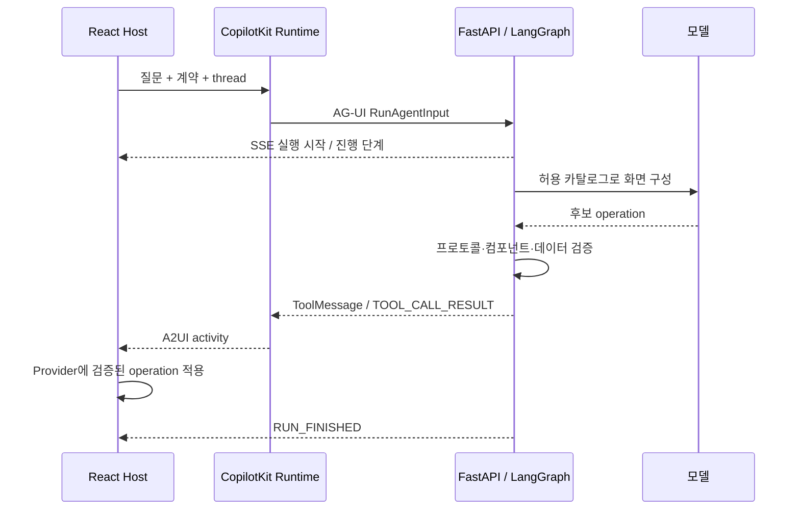

# 프로토콜, 사용자 action과 진행 SSE

[문서 지도](INDEX.md). A2UI-ACT-001 / A2UI-STATE-001 / A2UI-PROGRESS-001.

## 서로 다른 세 계약

| 계약 | 역할 | 현재 구현 |
| --- | --- | --- |
| A2UI v0.9 | UI 트리·데이터 모델·사용자 action | createSurface, updateComponents, updateDataModel, deleteSurface |
| AG-UI | 실행·메시지·도구·상태 스트림 | RunAgentInput 요청과 SSE 이벤트 |
| CopilotKit | React·Runtime·agent 연결 | 도구 결과를 A2UI activity로 렌더링 |

`@a2ui/web_core` 패키지 버전은 wire protocol 버전이 아니다. 실행 요청의 `forwardedProps.a2uiContract`에 protocolVersion/catalogId/sha256을 전달하고 Python이 서버 manifest와 비교한다. 구형 카탈로그나 잘못된 action은 HTTP422로 거절한다.

## 상태의 소유권

| 상태 | 소유자 | 지속 범위 |
| --- | --- | --- |
| messages | LangGraph AgentState | 메모리 checkpoint의 대화/도구 호출/ToolMessage |
| surfaces | 서버 graph state | 검증된 컴포넌트와 데이터의 권위 있는 사본 |
| 입력 중인 값 | React A2UI DataContext | surface의 로컬 바인딩 |
| SEC 검색·선택·보고서/revision | SecState.sec | 해당 thread |
| 카탈로그·manifest | 정적 생성물 | 배포된 버전 |
| 진행 단계 목록 | React RunProgress | 현재 화면의 최근 실행, 새 실행에서 초기화 |

A2UI ToolMessage는 `a2ui.render(operations)`가 만든 `a2ui_operations` envelope를 포함한다. 토큰 하나마다 ToolMessage를 쓰거나 모든 SSE 이벤트를 messages에 저장하지 않는다. 브라우저가 보내는 surfaces/tools로 서버 상태를 덮어쓸 수 없다. 검증된 사용자 action은 client messages를 전달하지 않고 checkpoint 이력을 사용한다. 취소된 모델의 미완성 JSON tool arguments가 action 재시도의 메시지 파싱을 깨뜨리는 문제를 방지한다. 일반 질문 요청의 이력은 유지한다.

## 화면 생성과 갱신



위 SSE는 실제로 Runtime을 경유한다. 최초 화면은 createSurface 이후 구조·데이터 operation을 적용한다. 이후 갱신은 같은 surfaceId에 적용한다. custom activity renderer는 agent.messages의 ToolMessage를 구독하며 `message.id:content` 단위로 중복을 방지한다. 동일 데이터라도 다른 메시지면 정상 재조회로 반영한다. SEC는 실제 ToolNode가 최초 TOOL_CALL_RESULT를 내보내도록 구성한다. STATE_SNAPSHOT에만 결과를 두면 최초 화면이 생성되지 않았던 사례가 있다.

## 사용자 action 왕복

1. Input/Select 등의 어댑터가 바인딩 경로에 로컬 값을 쓴다.
2. 제출 시 resolveAction이 최신 경로 값을 읽는다.
3. Host가 `a2uiAction`을 forwarded properties에 담아 같은 agent/thread를 실행한다.
4. 서버가 surfaceId, sourceComponentId, 허용 action 및 입력을 검사한다. SEC는 revision과 고정 context까지 검사한다.
5. 서버가 authoritative state로 계산·조회하고 기존 surface를 갱신한다.
6. 요청 종료 시 Host는 임시 a2uiAction 속성을 제거하고 입력을 다시 활성화한다.

공식 v0.9 envelope의 `action`과 SDK 내부의 `userAction`을 서버 경계에서 수용한다. 임의 Python 함수 호출, 클라이언트 본문 신뢰, 표시 가격을 근거로 한 업무 처리는 허용하지 않는다. `search_sales`는 별도 지역 조회 패널만 갱신하며 모델 분석 전체를 다시 생성하지 않는다. `select_flight`는 가상 선택 상태만 바꾼다. SEC action은 [SEC 설계](sec.md)에 정의한다.

## 진행 SSE

LangGraph `adispatch_custom_event` → AG-UI `CUSTOM` → Runtime → agent subscriber의 `onCustomEvent` 경로다. 별도 SSE endpoint나 타이머 기반 가짜 진행률은 없다.

```json
{"type":"CUSTOM","name":"a2ui.progress","value":{"stage":"composing"}}
```

| 단계 | 발생 지점 |
| --- | --- |
| connecting | 프런트엔드 실행 초기화. 서버 이벤트가 아닌 요청 전달 상태 |
| analyzing | Dynamic/Fixed의 generate 진입 |
| composing | Dynamic planner 첫 호출 직전 |
| validating | Dynamic planner 결과를 받은 뒤 계약·facts 검사 전 |
| retrying | 첫 결과의 계약 검증 실패 후 두 번째 planner 호출 직전 |
| delivering | 생성 결과를 graph 상태에 반영하고 반환하기 전 |
| updating | Dynamic/Fixed 사용자 action 적용 직전 |

stage만 전달하며 프롬프트·원문·내부 추론을 포함하지 않는다. 최대12개 단계 이력을 표시하고 알 수 없는 stage는 무시한다. Fixed는 Dynamic planner를 사용하지 않으므로 composing/validating 단계가 없다. SEC는 현재 상세 단계 이벤트 없이 요청 전달과 실행 수명주기만 보인다.

종료는 RUN_FINISHED→완료, RUN_ERROR(code=abort)→중단, 그 외 RUN_ERROR→실패다. AbortError도 중단으로 처리하며 완료 이벤트 없이 finalized된 경우 중단으로 표시한다. 첫 종료 판정을 유지해 후속 callback이 중단을 실패로 덮어쓰지 않는다. 새 실행은 이력을 초기화하고 새 대화는 컴포넌트를 다시 만든다.

## A2UI-STREAM-001: 점진 미리보기

Dynamic은 `forwardedProps.a2uiRenderMode`의 `batch` 또는 `progressive`를 수용한다. 화면은 기본으로 `progressive`를 명시해 전달하며, 옵션을 생략한 API 요청은 호환성을 위해 `batch`로 처리한다. 다른 값과 Fixed/SEC의 progressive 요청은 422다. 표시 옵션은 서버 surfaces/checkpoint 권한을 바꾸지 않는다.

`server/a2ui/preview.py`는 AG-UI `render_a2ui`의 TOOL_CALL_ARGS를 관찰한다. 완결된 components 항목만 파싱하고, root Row/Column의 준비된 자식 트리만 묶거나 다른 root의 완결된 트리를 구성한다. 공식 operation/catalog·트리 연결·facts 바인딩 검증을 통과해야 `CUSTOM(name=a2ui.preview, value={operations:[...]})`을 발행한다. updateDataModel에는 모델 값 대신 서버 FACTS만 사용한다. 미완성 JSON의 닫는 괄호를 추정하거나 임의 숫자를 표시하지 않는다. 인자 버퍼는 1,000,000자를 넘으면 해당 시도 미리보기를 중지한다.

각 미리보기 이벤트는 임시 surface의 전체 스냅샷이다. 최종 surface와 별도 ID를 사용하고 checkpoint에는 저장하지 않는다. 빈 operations는 미리보기 삭제다. 새 render 호출·외부 재시도·도구 결과·실행 종료에서 삭제하며, 클라이언트는 네트워크 실패/취소/finalized에서도 삭제한다. 최종 응답과 action은 기존 전체 검증·확정 경로를 유지한다. 생성 순서에 따라 미리보기가 늦게 나타나거나 생략될 수 있다.

## 오류·동시 실행

StreamGate는 활성10/대기10을 허용한다. 동일 mode/thread 중복 요청은409, 용량 초과는429다. lease는 스트림 종료·예외·취소에서 해제된다. 계약 실패를 빈 화면 성공으로 바꾸지 않는다. 모델 오류의 세부 request/credential을 wire에 포함하지 않고 서버 오류 경계에서 일반화한다. 재시작 시 메모리 checkpoint와 Runtime 상태는 소실된다.

참고: [AG-UI events](https://docs.ag-ui.com/concepts/events). 문서화 기준은 최신 웹 기능 전체가 아니라 저장소에 고정된 SDK 구현이다.
