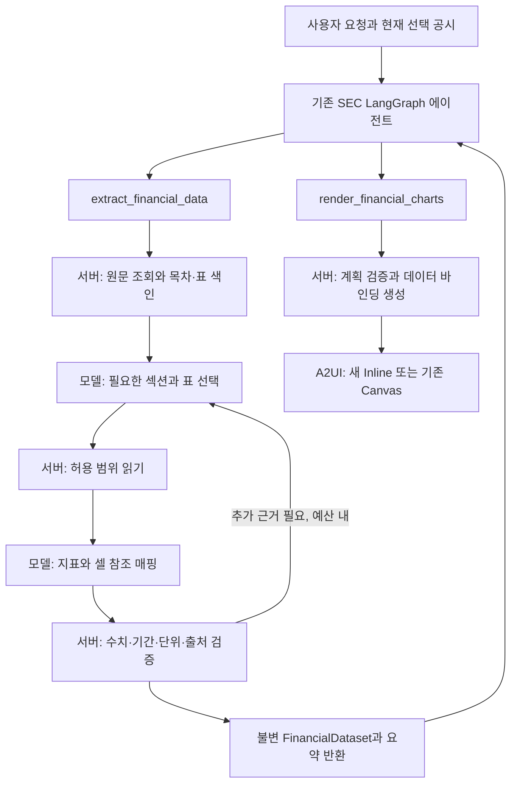

# SEC 재무 차트 설계

상태: **구현 및 필수 실행 검증 완료** (2026-09-23). 사용자 확정 범위는 [도메인 요구사항](../../us-corporate-filings/a2ui-system.md)의 SEC-CHART-001~006, 기존 동작은 [SEC](sec.md)가 소유한다. 원문 셀 검증·두 도구·6종 차트와 프롬프트 안내를 구현했다. 실행 결과와 제한은 [최종 검증 기록](../../../flow/2026-09-23-sec-financial-charts-validation.md)을 따른다.

## 1. 목표와 경계

선택한 공시 한 건에 실제로 기재된 재무제표를 읽고, AI가 등록된 차트·표·지표 카드를 조합한다. 같은 공시에 포함된 비교 연도는 사용할 수 있다. 다른 공시, 원본/수정본 자동 병합, Company Facts 등 별도 SEC 구조화 API는 사용하지 않는다.

사용자는 “이 보고서의 매출과 영업이익을 연도별로 비교해줘”라고 요청한다. 에이전트는 `extract_financial_data` 결과를 읽고 `render_financial_charts`를 호출한다. “선을 막대로 바꿔줘”는 기존 데이터로 렌더 도구만 호출한다. “현금흐름도 추가해줘”는 필요한 지표가 없으면 추출부터 다시 한다. 일반 기능 질문에는 두 도구 모두 필요 없다.

초기 추출 대상은 손익계산서·재무상태표·현금흐름표 및 요청한 지표에 직접 관련된 주석 표다. v1은 원문에 명시된 값만 지원한다. 성장률·마진·분기 역산·환율 변환·서로 다른 기간 합산 등 파생 계산은 제외한다. 추후 추가 시 서버의 이름 있는 공식과 입력 근거를 별도 계약으로 정의한다.

## 2. 확인한 기존 구현과 변경 경계

| 현재 확인한 코드 | 설계에 미치는 영향 |
| --- | --- |
| `domains/tenk/normalizer.py`가 HTML 태그를 제거하며 셀을 줄바꿈으로 바꿈 | 기존 요약용 텍스트에서 표를 복원하지 않는다. 원문 HTML에서 표 구조를 먼저 보존한다. 기존 요약 경로는 유지한다. |
| `sec_client.py:content`가 선택 CIK/accession의 본문 전체를 최대 32 MiB 읽음 | 네트워크 부분 조회를 가정하지 않는다. 서버가 한 번 가져와 로컬 색인을 만들고, 모델에 전달하는 범위만 제한한다. |
| 기존 ReportPlan은 요약/사업/재무/위험과 cards/table/accordion | 새 FinancialChartPlan을 별도로 둔다. 기존 분석 결과를 재무 수치의 원본으로 삼지 않는다. |
| 기존 `Chart`는 `{label,value}[]`의 bar/pie, SEC 프로필에는 미등록 | 기존 Chart 계약을 보존하고 `FinancialChart`를 추가한다. 한 컴포넌트에 6종의 엄격한 kind를 등록한다. |
| 동일 SEC graph의 ToolNode 및 `working_sec` → 검증 후 surface 반영 | 새 두 도구를 기존 에이전트에 추가하고 성공 시에만 화면과 데이터 참조를 반영한다. |

shadcn의 기존 `components/ui/chart.tsx`와 Recharts 기반 어댑터를 재사용한다. Chat 컴포넌트는 대화 컨테이너이고 Chart 컴포넌트는 A2UI가 렌더하는 결과다. UI 라이브러리 자체가 도구 호출이나 데이터 검증을 담당하지 않는다.

## 3. 실행 흐름과 책임



바깥 에이전트에는 두 도구만 추가한다. 추출 내부의 탐색·검증은 bounded async 함수로 묶는다. 내부 노드를 에이전트의 별도 공개 도구로 노출하지 않는다. 기존 10회 에이전트 판단 상한과 내부 읽기 예산은 별도로 적용한다. 추출 모델에는 네트워크·UI 도구를 주지 않는다.

- 모델: 요청 해석, 색인에서 읽을 위치 선택, 지표의 의미와 표 셀 대응, 차트 종류·구성 선택.
- 서버: 문서 권한/선택 범위, 실제 숫자 파싱, 표 좌표, 단위 변환, 데이터 보관, 차트 적합성 검사, A2UI 생성.
- React: 검증된 JSON props 렌더링, tooltip·범례·표·출처 표시. 원문 HTML 실행이나 임의 JavaScript를 허용하지 않는다.

## 4. 목차 기반 선택 읽기

### 색인

문서 조회 직후 `sourceHash = SHA256(UTF-8 원문)`과 `retrievedAt`을 기록한다. 서버는 HTML을 파싱해 목차 링크, 제목 계층, anchor, 표 위치를 수집한다. 모델에는 본문 없이 `sectionId, title, tableCount`와 표의 표 ID/행 개수/헤더 요약만 제공한다. ID는 해당 sourceHash 안에서만 유효하다.

목차가 없거나 링크가 깨졌으면 heading/Item/표 제목으로 대체 색인을 만든다. 이때 `indexMethod=heading_fallback`을 표시한다. “Item 8이면 항상 정답”으로 고정하지 않는다. 10-Q, 수정본, 표를 주석으로 보내는 문서에서도 실제 색인을 따라 선택한다. 색인이 길면 섹션과 표의 두 단계에서 최대 100개 항목씩 탐색하고 생략 범위를 알린다. 모델이 읽지 않은 목차 아래 전체를 분석했다고 표시하지 않는다.

HTML 원문 전체의 **서버 파싱**과 본문의 **모델 선택 읽기**를 구분한다. 현재 BFF API에 새 부분 읽기 endpoint를 추가할 필요는 없다. 외부 링크·첨부 문서·이미지를 따라가지 않는다. 표가 없는 텍스트나 이미지/PDF만 있는 원문은 v1에서 구조화 추출 불가로 반환한다.

### 표 읽기

`FinancialDocument.read(table_ids, budget, offsets)`는 공개 agent tool이 아닌 추출 내부 함수다. 서버가 발급한 ID만 허용한다. rowspan/colspan을 보존한 논리 셀 좌표와 원본 셀 위치를 함께 만들며, 통화 기호만 있는 셀·괄호·각주 기호·빈 spacer 셀을 처리한다. 복잡한 헤더를 해석할 수 없으면 해당 값을 거절한다.

표 제목, 기간 헤더 계층, 단위 문구, 행 제목, 선택 셀, 인접 설명/각주를 함께 반환한다. 큰 표를 자를 때 행 단위로 나누고 헤더·단위는 매 조각에 반복한다. 숫자 셀 중간을 자르지 않는다. 각 HTML 표는 독립 ID로 유지한다. 한 지표가 여러 표로 나뉘면 자동으로 이어 붙이지 않고 별도 근거로 취급한다.

현재 예산: 읽기 최대 3회, 회당 4개 섹션·8개 표, 회당 본문 24,000자, 누적 본문 60,000자, 색인 12,000자/회·누적 24,000자. 모델에 전달하는 payload JSON의 UTF-8 크기는 150,000 bytes로 제한한다. 토큰 수 기반의 별도 제한은 아직 없으므로 문자/바이트 예산과 모델 context 한도를 구분한다. 초과 표는 명시적으로 미열람 처리한다. 모델 형식 수정은 단계당 1회, 추출 전체 시간은 120초로 제한한다. 재시도도 누적 예산에 포함하고 취소 시 내부 작업과 HTTP를 정리한다. 이 제한 안에서 실제 10-K와 10-Q를 검증한다.

## 5. FinancialDataset 계약

서버 저장의 원본 데이터와 클라이언트의 표시용 숫자를 분리한다. 모델 도구 인자는 추가 필드를 거절하는 엄격한 스키마다. 서버가 구성한 데이터셋 최상위에 schemaVersion을 둔다.

| 필드 | 의미와 제약 |
| --- | --- |
| `datasetId`, `schemaVersion` | 서버 발급 ID, v1. 생성 후 내용 불변 |
| `filing` | 서버 선택의 CIK/accession/form/company; 모델 입력으로 덮어쓸 수 없음 |
| `source` | sourceHash, retrievedAt, parserVersion; 원문은 filing 식별자로 다시 조회 |
| `periods[]` | id, label, kind=`instant|duration`, start(기간형만), end, duration_class=`annual|quarter|ytd|other` |
| `metrics[]` | id, originalLabel, label, statement, dimension/currency/scale, scope, composition/isTotal |
| `observations[]` | metricId, periodId, exactValue(기본 단위의 Decimal 문자열 또는 null), status, sourceIds |
| `sources[]` | id, sectionId/title, tableId/title, row/column 및 헤더 경로, 원문 valueText/unitText/periodText, anchor(있을 때만) |
| `coverage` | 요청 지표, 발견/누락/충돌, 읽은 위치, 미열람 범위, 예산 사용, 경고 |

`exactValue`는 모델이 생성한 숫자를 채택하지 않는다. 모델이 제안한 `metric → table cell` 매핑을 서버가 실제 셀에서 파싱한다. 예: `(1,250)` + `USD in millions` → `-1250000000`. 원문 부호·단위와 파싱 결과가 대응해야 한다. 표 전역 단위가 EPS 행에 그대로 적용되지 않도록 행별 예외를 검증한다.

값 없음은 null이며 0으로 채우지 않는다. 대시도 원문 정의가 없으면 0으로 가정하지 않는다. 같은 지표·기간이라도 연결/부문, 재작성 전후, 계속영업 범위가 다르면 분리한다. 서로 충돌하는 후보를 평균하거나 임의 선택하지 않는다. 원문이 명시한 restated 비교값은 그 표시와 출처를 유지한다. 비교 가능한 관측치만 데이터셋의 시각화 가능 목록에 포함한다.

서버 검증은 셀 존재/숫자 일치와 스키마를 보장하지만 모델의 회계 의미 해석을 완전히 증명하지는 않는다. 따라서 행·열 제목과 단위 출처를 사용자에게 제공하고, 의미가 불명확한 값은 `ambiguous`로 차트에서 제외한다. confidence 점수만으로 승인하지 않는다.

초기 데이터셋 상한: 지표 30개, 기간 12개, 관측치 360개, 근거 포함 직렬화 512 KiB. 상한을 넘으면 요청을 좁히도록 안내하며 조용히 누락하지 않는다.

## 6. 두 도구의 공개 계약

### extract_financial_data

```ts
// 모델이 제공하는 인자. filing/thread/source URL은 runtime에서 주입한다.
{
  request: string;       // 1~500자, 사용자가 원하는 재무 지표/비교
  base_dataset_id?: string; // 같은 선택 공시의 데이터 확장 요청일 때만
}
```

성공 결과는 `status: complete|partial`, datasetId, metrics/periods의 ID와 단위·표시명, missing, warnings, coverage 요약이다. 원문 전체나 숫자 배열을 모델의 ToolMessage에 반복하지 않는다. `complete`는 요청 지표 충족을 뜻하며 문서 전체 분석을 뜻하지 않는다. 일부 지표만 검증되면 partial을 반환하고 후속 렌더는 검증된 부분만 명시적으로 사용할 수 있다. 지표가 하나도 검증되지 않으면 datasetId를 발급하지 않는다.

기존 데이터 확장은 새 datasetId를 만든다. 같은 thread·CIK·accession·sourceHash가 아니면 병합하지 않는다. 원문을 다시 읽었는데 hash가 달라지면 `SOURCE_CHANGED`로 새 추출을 요구한다. 추출 결과는 요청의 임시 작업 상태에 두고 성공한 렌더에서 활성 참조로 commit한다.

### render_financial_charts

```ts
{
  dataset_id: string;
  plan: {
    title: string; // 최대 100자
    columns: 1 | 2;
    blocks: Array<
      | { type: "chart"; kind: "bar" | "grouped_bar" | "stacked_bar" |
          "line" | "area" | "donut";
          metric_ids: string[]; period_ids: string[];
          category: "period" | "metric"; title?: string }
      | { type: "table"; metric_ids: string[]; period_ids: string[] }
      | { type: "metric"; metric_ids: [string]; period_ids: [string] }
    >; // 총 1~8 blocks, chart 최대 4개
  };
}
```

모델이 dataset 내부 ID만 선택하고 서버가 필터/정렬/단위/출처/색상을 결정한다. 기간 순서는 시간순, metric 순서는 계획 순서다. `surfaceId`, raw data, formatter, JavaScript, 임의 CSS/URL/데이터 경로는 입력으로 받지 않는다. 임의 중첩 트리 대신 columns와 순서 있는 blocks로 초기 자유도를 제한한다. 차트별 시리즈 최대 6개, 포인트 최대 24개로 제한한다.

반환은 기존 A2UI ToolMessage envelope와 `rendered`, 사용한 datasetId, warnings, 실제 출력 대상의 간단한 요약이다. 일반 도구 결과만 반환하고 실제 A2UI가 누락되는 경로를 회귀 검증한다. 검증 실패는 허용 가능한 지표/종류를 포함한 구조화 오류로 반환하여 모델이 계획을 한 번 수정할 수 있다. 사용자에게 알리지 않고 다른 차트로 바꾸지 않는다.

실패 코드(검출 위치에 따라): `NO_SELECTED_FILING`, `CONTENT_UNAVAILABLE`, `UNSUPPORTED_DOCUMENT`, `NO_VERIFIED_DATA`, `AMBIGUOUS_DATA`, `READ_BUDGET_EXCEEDED`, `SOURCE_CHANGED`, `DATASET_SCOPE_MISMATCH`, `INVALID_CHART_PLAN`. 사용자 문구와 code를 반환하며 예외의 원문이나 내부 URL을 그대로 노출하지 않는다. 기존 화면/선택은 실패 및 취소에 보존한다.

## 7. 차트 카탈로그와 적합성

`FinancialChart` 하나의 판별 스키마로 6종을 등록한다. 기존 `Chart`의 bar/pie 계약과 fixture를 유지한다. 내부 렌더러는 kind별 구현을 소유하고 공통 축/단위/범례/출처를 재사용한다. 재무 전용 확장 컴포넌트이므로 Registry의 “UI 파일 하나당 하나” 가정과 inventory 검사를 명시적으로 확장한다.

| kind | 기본 용도 | 필수 검증 |
| --- | --- | --- |
| bar | 단일 지표 기간 비교 또는 한 기간의 지표 비교 | 같은 단위·범위, 음수 허용, 0 기준 축 |
| grouped_bar | 매출/영업이익 등 복수 지표의 기간 비교 | 같은 단위, 동일 기간 집합; 누락은 gap |
| stacked_bar | 한 기간의 서로 겹치지 않는 구성 비교 | 원문 근거로 확인한 composition만; v1 음수 제외; 총계와 부분을 같이 쌓지 않음 |
| line | 기간별 추이 | 최소 2기간, 동일 instant/duration 종류와 durationClass, 시간순, null 연결 안 함 |
| area | 단일 지표 규모 추이 | line 조건, 단일 시리즈, 음수 제외; 누적 영역은 v1 제외 |
| donut | 한 기간의 구성 비중 | 동일 composition, 같은 단위, 2개 이상 비음수 항목, 합계>0; 전체 구성과 합계 근거가 확인되어야 함 |

예: 매출과 순이익은 서로 배타적인 구성요소가 아니므로 도넛/누적 막대로 묶지 않는다. 현금흐름의 음수 항목을 절댓값으로 바꾸지 않는다. 도넛의 “기타”를 임의 계산하지 않는다. 표/지표 카드로 제시하거나 적합한 막대 계획을 다시 선택한다. 이중 Y축, 통화 혼합, 금액과 주당이익의 한 축 혼합은 v1에서 거절한다.

FinancialChart props는 `kind, title, unitLabel, data: DataBinding, series[{key,label}], sources: DataBinding`이다. 색상은 React 어댑터의 고정 테마 팔레트이며 모델 인자가 아니다. 데이터 경로는 서버가 `/financial/charts/<blockId>/...` 아래 발급한다. 데이터모델의 표시 row는 `{label,<seriesKey>:number|null}`이며, 단위는 unitLabel, 원문 근거는 sources에 바인딩한다. Zod 원본과 생성된 SEC/Host JSON Schema가 실제 props 계약이다.

서버는 Decimal에서 공통 표시 단위로 먼저 축척한 뒤 유한한 JS number로 변환한다. 화면의 표시 정밀도에서 원본 Decimal과 일치하는지 확인하며 불가능한 값은 차트 계획을 거절하고 표로 요청하도록 안내한다. 독립 Table/Metric 블록은 exactValue 문자열을 사용하고, 차트 tooltip과 접이식 데이터 표는 정밀도 검증을 통과한 표시 단위 숫자를 사용한다. 혼합 단위는 차트를 나누고 모든 축에 통화·배율을 표시한다.

등록 경로: `definitions.ts` → 전용 financial 어댑터 → `catalog.tsx` → fixture/story → `pnpm a2ui:generate` → `pnpm a2ui:check`. SEC와 Host에 등록하며 기존 일반 Dynamic/Fixed의 허용 목록은 유지한다. SEC 화면의 Dynamic은 같은 SEC 프로필 안에서 모델이 계획을 선택한다는 뜻이다. SEC/Host의 catalogId는 1.1.0으로 확장했다. Dynamic/Fixed는 1.0.0과 기존 해시를 유지한다. 기존 catalogId를 조용히 재사용하지 않고 Host/Python/manifest를 함께 배포한다. 전체 버전 상향이 필요한 생성기라면 영향 프로필을 문서화하고 회귀 검증한다. 생성 JSON은 수동 수정하지 않는다.

## 8. 상태·출력 수명

별도 전역 캐시 없이 기존 SEC 상태에 현재 `financial_dataset`과 `financial_plan`을 둔다. 최신 Inline/Canvas의 `surface_contexts`가 각각 자기 데이터셋을 보존하므로 다른 화면의 회사와 섞이지 않는다. 새 추출은 `working_sec`에만 보관하고 검증된 렌더에서 commit한다. 데이터셋 한 건은 최대 512 KiB이며 raw HTML과 DOM은 checkpoint에 저장하지 않는다. 추출 완료/취소 시 실행 지역 변수의 원문·색인을 해제한다. InMemorySaver의 재시작 소멸 정책을 유지하며 DB/전역 캐시는 추가하지 않는다.

기존 두 활성 화면 문맥을 재사용한다. 도구는 현재 문맥의 dataset ID만 허용한다. 과거 Inline은 독립 UI/data 스냅샷으로 표시되며 재활성화하지 않는다. 이 선택은 사용자에게 필요한 재배치와 두 출력 흐름의 데이터 재사용을 유지하면서 별도 만료 정책을 없앤다.

데이터셋 접근은 ID 추측 여부와 관계없이 thread, 현재 실행 context의 CIK/accession, sourceHash를 확인한다. 최신 Inline과 Canvas의 `surface_contexts`에 각각 datasetId와 plan을 보존한다. 다른 회사로 이동하면 해당 작업 context의 활성 데이터 참조는 해제하되 다른 surface의 참조는 유지한다. 기존 데이터셋은 다른 선택의 새 렌더에 재사용할 수 없다.

자연어 요청의 context는 기존대로 마지막으로 성공한 화면이다. 화면 버튼은 발신 surface의 context를 따른다. 따라서 Canvas에서 선택한 회사와 최신 Inline의 회사가 달라도 섞이지 않는다. 일반 채팅이 어느 회사에 적용되는지는 선택 공시 요약에 노출한다.

- Inline: 성공한 새 렌더마다 새 surfaceId. 이전 결과는 데이터 바인딩까지 독립 스냅샷으로 보존한다.
- Canvas: 같은 surfaceId의 트리와 데이터모델을 검증 후 갱신한다. 사라진 block의 데이터도 제거한다.
- 기존 화면 안의 action: 기존 revision/발신 컴포넌트 검사 후 해당 surface만 갱신한다.
- 재배치: dataset 재사용. 재조회 없이 기존 retrievedAt을 유지하고 “이 추출 결과 기준”으로 표시한다.
- 데이터셋이 제거돼도 과거 Inline의 읽기 전용 차트는 ToolMessage 스냅샷으로 표시된다. 재렌더 요청은 재추출한다.
- 새 대화/재시작: 기존과 같이 선택·활성 데이터셋·Canvas 초기화. 복구를 보장하지 않는다.

## 9. 사용자 경험

기존 회사→공시→분석 흐름에 “재무 시각화” 바로가기를 추가한다. 바로가기는 “이 보고서의 주요 재무 지표를 시각화해줘”라는 자연어 요청을 전달하며 두 도구 호출을 서버에서 합성하지 않는다. 별도의 차트 설정 폼을 먼저 요구하지 않는다.

진행은 “목차 확인 → 재무 표 읽는 중 → 수치 검증 → 차트 구성” 한 줄로 표시한다. 기존 `a2ui.progress` payload 계약과 클라이언트 라벨 허용 목록을 함께 확장하며 실제 단계에서만 발행한다. 검증 전 수치를 preview로 노출하지 않는다.

결과에는 회사·공시·보고기간을 고정 표시하고 차트마다 제목, 단위, 기간, 읽을 수 있는 데이터 표, “출처 보기”를 제공한다. 출처는 섹션/표/행·기간 헤더/원문 값/단위를 텍스트로 표시하며 검증된 anchor가 없으면 정확한 위치 링크를 꾸며내지 않는다. 전체 coverage와 해시/조회 시각은 상세 영역에 둔다. 근거 없음·일부 추출·미열람 범위를 구분한다.

모바일은 1열, 넓은 화면은 계획의 최대 2열. 차트 높이는 기본 280px, 카드 최소 너비를 보장하고 표만 가로 스크롤한다. 기존 ChatViewport 높이 제한을 유지한다. 색상 외에 범례·축 라벨과 데이터 표로 정보를 전달한다. 읽기 전용 과거 Inline도 표/출처 펼치기는 가능하다. 부분 성공이면 “요청한 4개 중 3개 지표 확인”처럼 명시한다.

## 10. 구현 단위와 검증 기준

| 순서 | 담당 경로/변경 | 완료 기준 |
| --- | --- | --- |
| 1 | `domains/tenk/financial_document.py`, `financial_models.py` 신규 | 실제 저장 HTML의 목차·합쳐진 헤더·단위·셀 좌표를 보존하는 spike와 fixture 확보. 기존 normalizer 유지 |
| 2 | `financial_extraction.py` 신규 + SEC 내부 상태/도구 | 선택 읽기 예산과 원문 셀 검증, complete/partial/error 계약 |
| 3 | FE definitions/financial 어댑터/catalog/stories 및 계약 생성기 | 6종+표+지표 카드, SEC 프로필 검증, 기존 Chart 회귀 |
| 4 | `financial_chart_plan.py`, SEC `financial_surface.py` 신규 | dataset 참조 기반 plan 검증과 A2UI 생성, 원자적 상태 반영 |
| 5 | `sec_a2ui/agent_tools.py`, `workflow.py`, 상태 요약/진행 UI | 두 도구 실제 선택, 도움말 무호출, 데이터 재사용, Inline/Canvas 격리 |
| 6 | 기존 Bruno/Storybook/브라우저 suite | 아래 인수 시나리오, 정확한2820 실서비스 확인, 자원 정리 및 stock 구현 상태 갱신 |

위 파일은 구현 경로다. 표 파서는 Beautiful Soup을 명시 의존성으로 사용한다. HTML 복잡도·모델의 의미 매핑 정확도·긴 표의 예산 초과가 주요 검증 위험이다.

| 시나리오 | 예상 결과 | 검증 계층 |
| --- | --- | --- |
| 선택 없음/일반 도움말 | 추출하지 않고 선택 안내/일반 답변 | graph + Bruno + 브라우저 |
| 한 공시에 3개 비교 연도 | 해당 본문 값만 사용, 두 도구 순차 호출, 숫자와 근거 대조 | 단위 + Bruno + 실제 모델/브라우저 |
| 목차 없음/깨진 링크/이어진 표 | fallback 표시, 예산 내 탐색, 미열람 범위 공개 | 파서 fixture + Bruno |
| 괄호 음수/배율/EPS/대시/중복 기간 | 올바른 부호·단위·기간 또는 명시적 거절 | 순수 변환 단위 + API |
| YTD/분기/시점 혼합·부문/연결 혼합 | 부적합 비교 거절, 값 추정 없음 | 단위 + Bruno |
| 음수 도넛/총계와 부분 누적 | INVALID_CHART_PLAN, 표 또는 적합한 계획 재선택 | 단위 + Bruno + Storybook |
| 막대→선 변경 | 추출 도구 재호출 없음, 값/출처/조회 시각 유지 | graph + Bruno + 브라우저 |
| 새 지표 요청/다른 filing·thread ID | 새 추출 또는 scope 오류; 이전 데이터 누출 없음 | 단위 + Bruno |
| Inline 연속 요청·Canvas 연속 요청 | Inline 새 ID/과거 불변, Canvas 동일 ID/이전 block 제거 | Bruno + MCP 브라우저 |
| 모델 오류/취소/상한 초과/partial | 이전 정상 화면 보존, 허위 0·허위 완료 없음 | API + 브라우저 |
| 6개 kind·긴 라벨·모바일·출처 펼치기 | 축/표/출처 읽기 가능, 채팅 높이 보존 | A2UI 경유 Storybook + 브라우저 |

Bruno는 기존 `/ag-ui/a2ui/sec` SSE의 도구 결과·A2UI·실패를 검사하며 새 REST endpoint를 만들지 않는다. 실제 저장된 10-K와 10-Q 각각 한 건 이상에서 재무 표를 대조하고, 수정본·목차 부재·복잡 표는 fixture와 실제 사례의 증거를 구분한다. 고정 fixture 성공과 실제 모델의 두 도구 선택 성공을 따로 기록한다. OAuth/API-key 검증은 기존 승인 범위를 따르며 서로 대체하지 않는다.

API·Storybook·브라우저 검증은 구현 완료의 필수 gate다. 실제2820 Playwright, Bruno7요청, Storybook103검사를 통과했다. 상세한 실행 범위는 최종 검증 기록을 따른다. 이번 문서 검증 및 결정 기록: [설계 flow](../../../flow/2026-09-23-sec-financial-charts-design.md).

## 구현 계약 보충

- 모델 입력은 섹션 목차→선택 섹션의 표 색인→선택 표 셀로 나눈다. 목차는 최대 100개 항목 페이지, 최대 3회 탐색이며 인덱스 총 24,000자를 넘지 않는다. 표 본문은 최대 3회·회당 24,000자·총 60,000자, 모델 입력 JSON의 UTF-8 크기는 최대 150,000 bytes다. 긴 표는 원본 셀 ID를 유지한 행 단위 chunk와 nextRow로 이어 읽고 헤더를 반복한다. 빈 spacer 셀과 중복 좌표 필드는 모델 입력에서 제거한다.
- 기간 ID는 모델의 철자를 채택하지 않고 kind/start/end/duration_class로 정규화한다. 지표 ID는 원문 표·행·scope·dimension으로 만든다. 같은 연도에 모델이 다른 별칭을 써도 중복 축을 만들지 않는다. scope는 consolidated/parent/segment/other enum이다.
- 공개 모델 도구 인자는 Python 관례에 따라 dataset_id, base_dataset_id, metric_ids, period_ids를 쓴다. metric block도 metric_ids/period_ids 배열을 쓰되 서버가 각각 길이 1을 강제한다. 원문 데이터셋의 숫자는 exactValue Decimal 문자열이다. 단위 메타데이터는 별도 units 테이블 대신 각 metric의 dimension/currency/scale로 보관한다. 기간의 duration_class는 snake_case다.
- 내부 SectionSelection/TableSelection/ExtractionProposal 출력은 AG-UI의 emit-messages/emit-tool-calls metadata로 화면 스트리밍에서 제외한다. 외부의 두 실제 tool call과 단계 진행은 유지하며 검증 전 수치를 노출하지 않는다.
- 재무 시각화 바로가기는 현재 공시 문맥을 표시하고 자연어 요청을 기존 에이전트에 보낸다. 페이지의 접이식 프롬프트 안내는 조회→추출·구성→표현 변경→지표 추가와 Inline/Canvas 선택을 설명한다.
- 필수 인수 테스트: Python 원문/계획/도구 회귀, Bruno `18-sec-financial`, Storybook Financial 6종, Playwright `sec-financial.spec.ts`. 실문서 10-K와 10-Q의 원문 수치 대조는 고정 fixture 검증과 구분한다.

## SEC-CHART-REPAIR-001: 검증 실패 교정

첫 추출에서 검증된 숫자가 하나도 없으면 이미 읽은 표와 구체적인 거절 사유로 셀 매핑을 한 번 교정한다. 공시 종류·보고일·제출일은 서버 선택 문맥으로 전달한다. 교정은 기존120초 한도 안에서 수행하고 동일 원문/셀/단위/기간 검증을 다시 적용한다. 재실패는 일반적인 “수치 없음” 대신 제한된 상세 사유를 반환하고 기존 선택·화면을 보존한다. [실패 관찰과 변경 기록](../../../flow/2026-09-23-sec-financial-extraction-repair.md).
