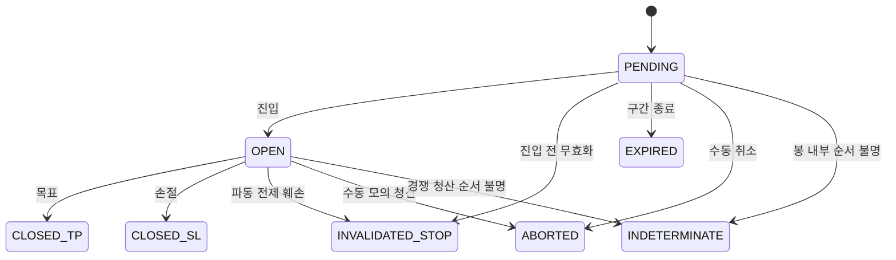

# 전략 실행 모니터링 구현 명세

결정 ID: SM-001. 상태: 구현·검증 완료. 2026-09-27.

## 범위와 정책

확정된 TradePlan JSON을 저장소에서 복원해 같은 planId의 실행 상태를 유지한다. 교육용 long 모의매매이며 실제 거래소 주문은 보내지 않는다. Replay와 Binance 확정봉 평가가 동일한 순수 상태 머신을 사용한다. 현재가는 마지막 공개/관측 확정봉 종가다. 틱 실시간 가격으로 오인하지 않도록 관측 시각을 표시한다. Binance 자동 감시는 사용자 Start/Stop으로 새 확정봉을 주기 조회한다.

기본 정책은 파동 전제 훼손 시 자동 중단(auto-abort), 선택적으로 warn-only를 허용한다. plan 확정 당시 정책과 규칙을 함께 고정한다. 구계획은 수정하지 않고 기존 invalidationPrice를 기본 규칙으로 해석한다. 수수료·슬리피지0, 수량1 기준을 명시한다.

## 상태와 이벤트

PENDING → OPEN → CLOSED_TP/CLOSED_SL. 무효화 자동중단은 INVALIDATED_STOP, 미진입 시나리오 종료는 EXPIRED. 수동중단은 ABORTED를 사용한다. OHLC만으로 진입·TP·SL·무효화 순서를 판단할 수 없으면 INDETERMINATE이며 임의 수익률을 계산하지 않는다. 종결 상태는 이후 봉에서 되살리지 않는다. 기존 touch-v1 평가 status는 유지하고 monitoring 결과를 별도로 연결한다.

이벤트는 planId, 안정적인 순번/ID, kind, candleTime, recordedAt, price, reason을 저장한다. PLAN_LOADED, WARNING, ENTERED, INVALIDATED, CLOSED_TP, CLOSED_SL, ABORTED, EXPIRED, INDETERMINATE를 구분한다. 동일봉 재조회는 이벤트를 중복 생성하지 않는다. revision은 새 실행을 만들고 이전 실행/이벤트를 보존한다.

## 무효화·경고·손익

확정 입력에서 별도 가격 경계(rule price-level)를 지정할 수 있다. 생략하면 기존 Wave0 invalidationPrice를 사용한다. low≤level 터치가 파손이며 SL과 구분한다. wave4-overlap은 명시적으로 확인한 공개 Wave3 끝점이 있어야 설정 가능하다. 서버가 Wave1 고점을 경계로 도출하고 Wave3 이후에만 적용한다. 임의 미래 인덱스/아직없는 Wave3는 거부한다. 이 앱은 OHLC에서 파동단계를 자동확정하지 않는다.

Warning은 종가가 유효한 무효화 경계에서 initialRisk의10% 이내인 경우. Healthy/Warning/Invalidated와 마지막 종가, 1단위 미실현손익, 고정된 최초위험 대비 live R, 경계까지가격/퍼센트 이격도를 보여준다. pending/terminal/unknown 포지션은 미실현손익을 null로 보여준다. 자동중단의 가격은 이미 열린 포지션의 시가갭은 시가, 장중단독터치는 경계다. 서로 경쟁하는 장중조건은 INDETERMINATE로 보존한다. 수동중단은 이미 공개된 마지막 종가를 사용하고 이유를 요구한다.

## API·화면·검증

실행 상태는 SessionView.monitoring(현재), monitoringHistory(계획별 이력)에 추가한다. 추가필드는 기존JSON에 기본값을 적용한다. POST /api/sessions/:id/monitoring/abort {expectedPlanId,expectedCursor,reason}는 stale/terminal 중복을409로 거부한다. Replay/evaluate가봉별상태와events를원자적으로저장한다. JSON export에 monitor schemas/원본/events를 포함하고 TradeEvaluation feedback에 monitor요약을 연결한다.

UI는 계획폼에서 policy/가격경계/Wave3 확인점, 확정이후 모니터링패널·수동중단·Binance 자동감시, 차트에 별도무효화선·이벤트이력을 제공한다. Primer라이트/다크 토큰을 사용한다.

검증: 순수 상태전이·갭·동시터치·무효화-before-SL·warn-only·고정risk·중복봉, API저장/복원/abort-stale/export, Storybook상태, 실제UI계획→관측→무효화→로그, Binance감시Start/Stop. 기존44유닛 회귀.

## 확정된 기본 정책과 구현 보완

사용자가 자동 중단을 선택했다. `ConfirmPlanInput.monitoring`에서 선택 정책을 받고, 확정된 `TradePlan.monitoringConfig`에 서버가 계산한 규칙을 고정한다. `price-level`은 계획 확정 순간의 공개 종가보다 낮아야 한다. 새 계획 이전의 장중 저가 터치는 그 계획의 실행 이벤트로 소급하지 않는다. `wave4-overlap`은 공개 Wave3 뒤에 이미 발생한 1파 영역 침범을 거부한다.

초기 위험은 `entry-stopLoss`의 원값을 고정한다. 같은 가격의 SL·무효화는 자동중단을 우선하며, SL이 무효화보다 위에 있으면 하락 경로에서 SL이 먼저다. 목표와 하방 청산의 장중 경쟁은 순서를 가정하지 않는다. 종결 이후 새 봉은 현재 종가·관측 시각만 갱신하고 원본 청산값·이벤트를 되살리지 않는다.

경고 전용 정책은 INVALIDATED 이벤트를 기록하되 포지션을 자동 종료하지 않는다. 가격 조건만 적용한 touch-v1 비교 평가는 별도 패널로 표시한다. 실행 모니터링의 realizedR과 혼동하지 않도록 명시한다.

실행 결과는 [검증 보고서](../validation/strategy-monitoring.md)에 기록한다.
