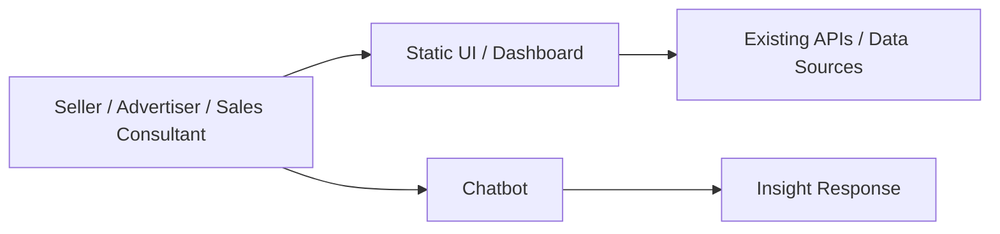
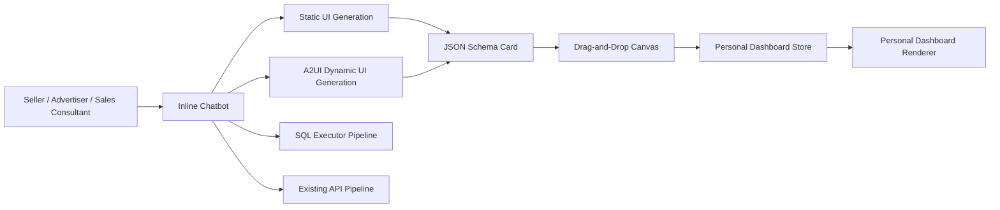

# Dynamic Canvas Technical Proposal

> This proposal starts from the customer/user experience and works backward to the technical design needed to deliver it.

---

## 0. Document Information

| Item | Details |
|---|---|
| Proposal | Dynamic Canvas |
| Status | Draft |
| Created / Target | TBD / Complete PoC within 2 weeks |

## 1. One-Sentence Decision Request

> Adopt a dynamic canvas rendering architecture that lets users save and revisit insights and charts discovered during chatbot conversations in their personal dashboards.

## 2. Writing Principles

- Define first who is experiencing the largest problem: customer, user, or operator.
- Start from the customer outcome that is actually needed, not only from what we can build today.
- Include cost, risk, operational burden, and rollback planning, not only benefits.
- In review meetings, participants read the document first and then ask questions.

---

# Part A. Working Backwards PR/FAQ

## 3. Future Press Release

### 3.1 Title

Dynamic Canvas: Save advertising insights discovered in AI conversations directly to a personal dashboard

### 3.2 Subtitle

Sellers, Amazon seller advertisers, and sales consultants can capture important insights and graphs from chatbot analysis and build them into their working dashboard.

### 3.3 Launch Summary

Dynamic Canvas is an AI insight dashboard experience for sellers, Amazon seller advertisers, and sales consultants. Users can drag and drop text insights, tables, line/bar charts, and advertising GMV forecast cards discovered during chatbot conversations into a personal dashboard. This lets customers discover, preserve, and reuse meaningful advertising and revenue insights with an AI assistant and data, without relying only on limited static screens or overwhelming data-heavy dashboards.

### 3.4 Customer Problem

Today, customers can only access limited information through static UIs and fixed dashboards. If we expose more information, customers must search through too much data to find useful insights. If the product and engineering teams keep curating only the best information into static product surfaces, the resource burden becomes too high.

- Customers struggle to capture context-specific insights immediately because they rely on static screens and fixed reports.
- This problem repeats during advertising performance reviews, GMV forecasting, campaign budget decisions, and sales consulting report preparation.
- Existing alternatives include expanding static dashboards or adopting a generative BI tool. Static dashboards are not flexible enough, and generative BI tools may not connect naturally to chatbot conversations inside the product experience.

### 3.5 Proposed Solution

Dynamic Canvas turns specific cards inside chatbot messages into savable UI blocks, allowing users to move only the cards they need into their personal dashboard. The system combines Static UI Generation and A2UI-based Dynamic UI Generation to generate UI from JSON schema, then uses a drag-and-drop canvas system for saving and revisiting those cards.

- Customers can save meaningful insights, tables, graphs, and advertising GMV forecast cards from chatbot conversations into their personal dashboard.
- The system generates static/dynamic UI cards inside the inline chatbot, then uses savable card schema and a canvas renderer to compose reusable views.
- Operators can support customer-specific analysis flows without pre-building every request as a static screen.

## 4. Key FAQ

### Q1. Who is the primary customer for this proposal?

The primary customers are sellers, Amazon seller advertisers, and sales consultants. They frequently review advertising performance and revenue trends, and they need to reuse insights discovered during chatbot analysis for later business decisions or customer communication.

### Q2. What will customers do better with this proposal?

Customers can turn advertising and revenue insights discovered through AI assistant conversations into reusable personal dashboard content instead of consuming them as one-off answers. This especially helps them revisit evidence needed for campaign reviews, budget change decisions, GMV forecast checks, and consulting report preparation.

### Q3. Which metrics should change if this succeeds?

| Metric | Current | Target | Measurement |
|---|---:|---:|---|
| Dashboard save rate | TBD | TBD | Percentage of chatbot insight/graph cards saved to the dashboard |
| Saved content revisit rate | TBD | TBD | Percentage of saved cards reopened within a defined period |
| Chatbot analysis session conversion rate | TBD | TBD | Percentage of sessions focused on advertising/revenue analysis versus general queries |
| Decision action linkage rate | TBD | TBD | Percentage of saved insights followed by budget changes, campaign reviews, report creation, or similar actions |

### Q4. Why now?

Customer demand for advertising/revenue data and insights continues to grow, but implementing every request as a static UI quickly consumes product and engineering capacity. At the same time, simply exposing more data makes it harder for customers to find the key insight. Combining chatbot-based analysis with a dynamic canvas creates a product experience where customers can select only the cards they need and accumulate them in a personal dashboard at the moment of discovery.

### Q5. What is explicitly out of scope for this proposal?

- Not included: real-time data refresh, high-performance rendering optimization, cost reduction, dashboard sorting/editing/sharing/report generation
- Future candidates: saved card editing, shared dashboards, report generation, team/account-level dashboards, advanced BI exploration

---

# Part B. Six-Page Narrative Technical Proposal

## 5. Summary

Dynamic Canvas is a dynamic canvas rendering architecture that allows users to save and revisit insight and graph cards generated during chatbot conversations in a personal dashboard. The primary customers are sellers, Amazon seller advertisers, and sales consultants, who struggle to find work-relevant insights between the limitations of static UI and the noise of excessive data exposure. This proposal validates an MVP by combining Static UI Generation, A2UI-based Dynamic UI Generation, JSON schema-based UI generation, and a drag-and-drop canvas system. The decision request is to complete a Dynamic Canvas PoC within two weeks and use it to decide whether to adopt the dynamic canvas rendering architecture.

## 6. Current State and Limitations

### 6.1 Current Customer/User Flow

1. Customers review advertising/revenue data through a static dashboard or fixed UI.
2. If the needed information is missing, they ask follow-up questions through a chatbot or separate analysis flow.
3. Insights or graphs generated by the chatbot remain inside the conversation and are hard to accumulate in a personal work dashboard.
4. Customers or sales consultants must later search for or regenerate the same information when making decisions or preparing reports.

### 6.2 Current System

### 6.3 Limitations of the Current Approach

| Limitation | Customer/Business Impact | Technical Cause | Evidence |
|---|---|---|---|
| Limited information is available | Customers cannot immediately get context-specific insights from the screen | Screens and data must be predefined around static UI | Customer needs and analysis cases are diverse |
| More information increases exploration burden | Customers must find insights themselves inside large datasets | Dashboards do not reflect user-specific context | Questions repeat during advertising/revenue analysis sessions |
| Productizing good insights every time is difficult | Product and engineering teams cannot respond quickly enough | Cards, charts, and reports must be built individually as static features | Development cost rises as requirements grow |
| Chatbot insights are not accumulated | Useful answers are consumed as one-off responses | Chat responses and dashboard storage models are disconnected | Revisit, reporting, and decision linkage are difficult |

## 7. Goals and Success Criteria

### Goals

- Customer value goal: Let users save insights discovered in the chatbot to a personal dashboard and revisit them later.
- Business/organizational goal: Expand the advertising/revenue analysis experience without pre-building every customer request as a static UI.
- Technical quality goal: Render text insights, tables, line/bar charts, and advertising GMV forecast cards from JSON schema.
- Operational goal: Compare a SQL executor pipeline with an existing API integration pipeline and choose the scalable direction after the PoC.

### Non-Goals

- Real-time data refresh is not part of the MVP.
- High-performance rendering optimization is not an MVP goal.
- Cost reduction is not a direct goal of this proposal.
- Dashboard sorting, editing, sharing, and report generation are excluded from the MVP scope.

### Success Criteria

| Criterion | Target | Measurement |
|---|---:|---|
| Dashboard save rate | TBD | Percentage of chatbot insight/graph cards saved to the dashboard |
| Saved content revisit rate | TBD | Percentage of saved cards reopened within a defined period |
| Chatbot analysis session conversion rate | TBD | Percentage of sessions focused on advertising/revenue analysis versus general queries |
| Decision action linkage rate | TBD | Track budget changes, campaign reviews, report creation, or similar actions after save events |

## 8. Proposed Solution

### 8.1 Core Idea

Dynamic Canvas treats chatbot responses as savable UI card units, not only as text. The chatbot generates specific cards inside a message, and the user drags only the useful cards into a user-specific personal dashboard.

Technically, the solution uses both Static UI Generation and A2UI-based Dynamic UI Generation. Each card is represented as JSON schema, and the canvas renderer interprets that schema to render text insights, tables, line/bar charts, and advertising GMV forecast cards. The PoC compares a SQL executor pipeline with the existing API integration pipeline for data retrieval.

### 8.2 Target Architecture

### 8.3 Major Changes

| Area | Current | After Change | Expected Effect |
|---|---|---|---|
| Chatbot response | Text or one-off response | Specific cards inside messages become savable units | Useful insights become reusable |
| UI generation | Static UI centered | Static UI Generation + A2UI Dynamic UI Generation | Generate context-specific cards |
| Rendering | Pre-built screens | JSON schema-based card renderer | Extend to text, tables, charts, and forecast cards |
| Dashboard | Fixed screen | User-specific personal Dynamic Canvas | Save only needed insights in a personalized way |
| Data retrieval | Existing API centered | Compare SQL executor and existing API approaches | Choose an extensible data pipeline after the PoC |

### 8.4 Operating Model

| Area | Proposal |
|---|---|
| Deployment | Release progressively: developer demo, internal sales validation, beta, then general availability |
| Monitoring/alerts | Track save rate, revisit rate, analysis session conversion rate, and decision action linkage rate |
| Incident response | Fall back to plain text responses when card generation fails, and provide retryable state when save fails |
| Cost management | Measure AI UI generation, data retrieval, and GMV forecast card generation costs during the PoC |

## 9. Alternatives Considered

| Alternative | Pros | Cons | Decision |
|---|---|---|---|
| Option A: Dynamic Canvas | Naturally connects chatbot conversations with personal dashboards and allows users to save only needed insights | Requires validation of schema quality, latency, security, and data accuracy | Selected |
| Option B: Generative BI tool | High exploration flexibility and broad analysis screen generation | May be disconnected from the in-product chatbot flow and can make the MVP scope too large | Deferred |
| Option C: Extend existing static dashboard | Familiar implementation model and lower operational risk | Customer-specific needs continue to require static feature development, sustaining resource burden | Rejected |
| Option D: Do nothing | No implementation cost | Static UI limitations and one-off chatbot insights remain unresolved | Rejected |

Rationale:
Dynamic Canvas connects chatbot and dashboard experiences inside the current product while staying smaller in MVP scope than a generative BI tool. It is more flexible than extending static dashboards and can validate the core assumptions of card generation, saving, revisiting, and canvas UX within a two-week PoC.

## 10. Risks and Validation Plan

| Item | Details | Mitigation |
|---|---|---|
| Core assumption | Users will find it valuable to save and revisit specific cards from chatbot messages in a personal dashboard | Validate save intent and revisit intent through developer demo and internal sales validation |
| Cost risk | AI UI generation, data retrieval, and advertising GMV forecast card generation may increase cost | Measure per-card generation cost and data retrieval cost during the PoC |
| Latency risk | End-to-end latency across chatbot response, data retrieval, UI generation, and canvas save may become too high | Measure latency by static/dynamic generation path and provide fallback responses |
| Data accuracy risk | SQL executor results, existing API results, GMV forecasts, and AI explanations require accuracy validation | Compare SQL executor and existing API integration approaches, and show source data and generation time on forecast cards |
| Security/privacy | Advertising/revenue data is saved to user-specific personal dashboards, and missing authorization controls could expose data | Include user permission-based save/retrieve, data scope checks, and sensitive data masking in the PoC design |
| Operational risk | Saved cards may break when card schema or renderer behavior changes | Design schema versioning and renderer fallback |

## 11. Execution and Launch Plan

### 11.1 Milestones

| Phase | Deliverable | End Date | Approval Criteria |
|---|---|---|---|
| PoC design | Card schema draft, renderer scope, data pipeline comparison criteria | Day 2 | Requirements agreed for text/table/chart/GMV forecast cards |
| Data pipeline validation | Comparison result for SQL executor and existing API integration approaches | Day 5 | At least one advertising/revenue analysis scenario can retrieve data |
| Inline chatbot UI generation | Static UI Generation and A2UI Dynamic UI Generation demo | Day 8 | Four MVP block types can be generated inside chatbot messages |
| Canvas UX validation | Drag-and-drop save and personal dashboard revisit demo | Day 11 | A specific card inside a message can be saved and revisited |
| Developer demo | End-to-end PoC demo and risk report | Day 14 | Decide whether to proceed to internal sales validation |
| Internal sales validation | Sales consultant feedback | TBD | Decide beta scope and improvement priorities |
| Beta | Beta for selected sellers/advertisers | TBD | Success metrics can be measured |
| General availability | Release to all users | TBD | Security, accuracy, and operational criteria are met |

### 11.2 Dependencies and Rollback

| Type | Details | Deadline/Condition |
|---|---|---|
| Dependency | Chatbot responses must be able to generate card-level metadata | PoC design phase |
| Dependency | At least one of the SQL executor or existing API data retrieval paths must provide MVP data | Day 5 |
| Dependency | A personal dashboard store and user-level access control model are required | Day 11 |
| Rollback condition | Core criteria for card generation quality, latency, data accuracy, or security are not met | Before/after developer demo |
| Rollback action | Disable Dynamic Canvas saving and fall back to basic chatbot responses or static card rendering | Immediate |

## 12. Open Questions and Decision Log

| Type | Details | Deadline/Date |
|---|---|---|
| Open question | What baseline should be used to set target values for each success metric? | After PoC |
| Open question | Which data pipeline should become the standard after MVP: SQL executor or existing API integration? | Day 5 |
| Open question | How should the confidence criteria and explanation style for advertising GMV forecast cards be defined? | During PoC |
| Open question | What retention period and deletion policy should apply to data saved in personal dashboards? | Before beta |
| Decision log | Use Dynamic Canvas as the proposal name | 2026-06-25 |
| Decision log | Remove organization, owner, and decision-maker fields from document information | 2026-06-25 |
| Decision log | Set the PoC target timeline to two weeks | 2026-06-25 |

---

# Part C. Review Operations

## 13. Review Meeting Format

1. Everyone silently reads the document and adds comments for 20-30 minutes.
2. The author does not present; the author answers questions.
3. Every participant gives an overall assessment.
4. The most senior participant speaks last.
5. The final 10 minutes are used to confirm the decision, reasons for deferral, and next actions.

## 14. Quality Checklist

- [x] Customer/user is clear.
- [x] Customer problem is written from the customer perspective.
- [x] Success criteria are defined with measurable metrics.
- [x] Alternatives and trade-offs are clear.
- [x] Security, privacy, operations, and cost impact are included.
- [ ] Migration and rollback plan is included.
- [x] Core assumptions and validation methods are included.
- [x] Open questions and decision deadlines are clear.

---

# Part D. Appendix

## A. Supporting Evidence

- User interviews: TBD
- VOC: TBD
- Chatbot analysis logs: TBD
- Dashboard usage logs: TBD
- Data retrieval and UI generation benchmarks: To be measured during the PoC
