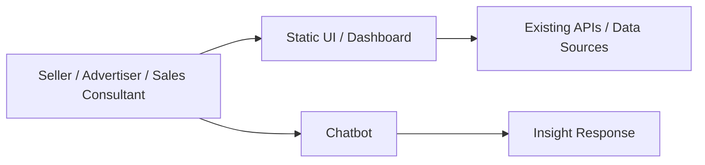
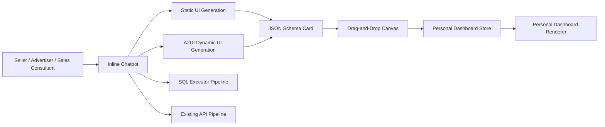

# Dynamic Canvas 기술 제안서

> 고객/사용자 경험을 먼저 정의하고, 그 경험을 만들기 위해 필요한 기술을 거꾸로 설계하는 제안서입니다.

---

## 0. 문서 정보

| 항목 | 내용 |
|---|---|
| 제안명 | Dynamic Canvas |
| 상태 | Draft |
| 작성일 / 목표일 | TBD / PoC 2주 내 완료 |

## 1. 한 문장 결정 요청

> 챗봇 대화 중 발견한 인사이트와 그래프를 사용자별 개인 대시보드로 저장하고 재조회할 수 있도록 동적 캔버스 렌더링 구조를 도입한다.

## 2. 작성 원칙

- 고객, 사용자, 운영자 중 누가 가장 큰 문제를 겪는지 먼저 정의한다.
- 현재 만들 수 있는 것보다 고객이 실제로 필요로 하는 결과를 먼저 쓴다.
- 장점뿐 아니라 비용, 리스크, 운영 부담, 롤백 계획을 함께 쓴다.
- 회의에서는 발표 전에 참석자가 문서를 먼저 읽고 질문한다.

---

# Part A. Working Backwards PR/FAQ

## 3. 미래 보도자료

### 3.1 제목

Dynamic Canvas: AI 대화에서 발견한 광고 인사이트를 개인 대시보드로 바로 저장

### 3.2 부제

셀러, Amazon 셀러 광고주, 세일즈 컨설턴트가 챗봇 분석 중 발견한 핵심 인사이트와 그래프를 놓치지 않고 업무 대시보드로 축적한다.

### 3.3 출시 요약

Dynamic Canvas는 셀러, Amazon 셀러 광고주, 세일즈 컨설턴트를 위한 AI 인사이트 대시보드 기능이다. 사용자는 챗봇과 대화하며 발견한 텍스트 인사이트, 표, 라인/바 차트, 광고 GMV 예측 카드를 개인 대시보드로 drag-and-drop 저장할 수 있다. 이를 통해 고객은 한정된 정적 화면이나 과도한 데이터 목록에 의존하지 않고, AI assistant와 데이터를 함께 활용해 의미 있는 광고/매출 인사이트를 발굴하고 재사용한다.

### 3.4 고객 문제

현재 고객은 정적 UI와 고정된 대시보드에서 제공되는 제한적인 정보만 확인할 수 있다. 정보를 더 많이 제공하면 고객은 수많은 데이터 속에서 직접 인사이트를 찾아야 하고, 반대로 제품/개발팀이 좋은 정보만 선별해 계속 제공하려면 높은 리소스 부담이 발생한다.

- 현재 고객은 정적 화면과 고정된 리포트 때문에 개별 상황에 맞는 인사이트를 즉시 축적하기 어렵다.
- 이 문제는 광고 성과 점검, GMV 예측, 캠페인 예산 판단, 세일즈 컨설팅 리포트 준비 과정에서 반복된다.
- 기존 대안은 정적 대시보드 확장 또는 생성형 BI 툴이지만, 정적 대시보드는 유연성이 낮고 생성형 BI 툴은 제품 경험 안에서 챗봇 대화와 자연스럽게 연결되기 어렵다.

### 3.5 제안 솔루션

Dynamic Canvas는 챗봇 메시지 안의 특정 카드를 저장 가능한 UI 블록으로 만들고, 사용자가 필요한 카드만 개인 대시보드로 옮길 수 있게 한다. 시스템은 Static UI Generation과 A2UI 기반 Dynamic UI Generation을 함께 사용해 JSON schema 기반 UI를 생성하고, drag-and-drop canvas 시스템으로 저장/재조회 경험을 제공한다.

- 고객은 앞으로 챗봇 대화 중 의미 있는 인사이트, 표, 그래프, 광고 GMV 예측 카드를 개인 대시보드에 저장할 수 있다.
- 시스템은 inline chatbot 안에서 정적/동적 UI 카드를 생성하고, 저장 가능한 카드 schema와 canvas renderer를 통해 재사용 가능한 화면을 구성한다.
- 운영자는 모든 고객 요구를 정적 화면으로 미리 구현하지 않고도 고객별 분석 흐름을 지원할 수 있다.

## 4. 핵심 FAQ

### Q1. 누가 이 제안의 주 고객인가?

주 고객은 셀러, Amazon 셀러 광고주, 세일즈 컨설턴트다. 이들은 광고 성과와 매출 흐름을 자주 확인하고, 챗봇 분석 과정에서 발견한 내용을 이후 업무 판단이나 고객 커뮤니케이션에 재사용해야 한다.

### Q2. 고객은 이 제안을 사용하면 무엇을 더 잘하게 되는가?

고객은 AI assistant와 대화하며 발견한 광고/매출 인사이트를 일회성 답변으로 소비하지 않고 개인 대시보드에 축적할 수 있다. 특히 캠페인 점검, 예산 변경 검토, GMV 예측 확인, 컨설팅 리포트 준비에 필요한 근거를 더 쉽게 다시 찾을 수 있다.

### Q3. 성공하면 어떤 지표가 바뀌어야 하는가?

| 지표 | 현재값 | 목표값 | 측정 방법 |
|---|---:|---:|---|
| 대시보드 저장률 | TBD | TBD | 챗봇 응답 중 인사이트/그래프 카드가 대시보드로 저장된 비율 |
| 저장 콘텐츠 재방문율 | TBD | TBD | 저장된 카드가 일정 기간 내 다시 열린 비율 |
| 챗봇 분석 세션 전환율 | TBD | TBD | 일반 질의 대비 광고/매출 분석 목적 세션 비율 |
| 의사결정 액션 연결률 | TBD | TBD | 저장된 인사이트 이후 예산 변경, 캠페인 점검, 리포트 작성 등 후속 행동으로 이어진 비율 |

### Q4. 왜 지금 해야 하는가?

고객에게 제공해야 할 광고/매출 데이터와 인사이트 요구는 계속 늘어나지만, 모든 요구를 정적 UI로 구현하는 방식은 제품/개발팀 리소스를 빠르게 소모한다. 동시에 단순히 데이터를 많이 노출하는 방식은 고객이 핵심 인사이트를 찾기 어렵게 만든다. 챗봇 기반 분석 경험과 동적 캔버스를 결합하면, 고객이 필요한 순간에 필요한 카드만 선택해 개인 대시보드로 축적하는 제품 경험을 만들 수 있다.

### Q5. 이번 제안에서 하지 않는 것은 무엇인가?

- 포함하지 않음: 실시간 데이터 갱신, 고성능 렌더링 최적화, 비용 감소, 대시보드 정렬/편집/공유/리포트 생성
- 다음 단계 후보: 저장된 카드 편집, 공유 대시보드, 리포트 생성, 팀/계정 단위 대시보드, 고도화된 BI 탐색 기능

---

# Part B. 6페이지 내러티브 기술 제안

## 5. 요약

Dynamic Canvas는 챗봇 대화 중 생성된 인사이트와 그래프 카드를 사용자별 개인 대시보드로 저장하고 재조회할 수 있게 하는 동적 캔버스 렌더링 구조다. 주 고객은 셀러, Amazon 셀러 광고주, 세일즈 컨설턴트이며, 이들은 정적 UI의 제한성과 과도한 데이터 노출 사이에서 업무에 필요한 인사이트를 찾는 데 어려움을 겪는다. 본 제안은 Static UI Generation과 A2UI 기반 Dynamic UI Generation, JSON schema 기반 UI 생성, drag-and-drop canvas 시스템을 결합해 MVP를 검증한다. 의사결정 요청은 Dynamic Canvas PoC를 2주 안에 완료하고, 동적 캔버스 렌더링 구조 도입 여부를 판단하는 것이다.

## 6. 현재 상태와 한계

### 6.1 현재 고객/사용자 흐름

1. 고객은 정적 대시보드 또는 고정 UI에서 광고/매출 데이터를 확인한다.
2. 필요한 정보가 없으면 챗봇이나 별도 분석 흐름을 통해 추가 질문을 한다.
3. 챗봇에서 얻은 인사이트나 그래프는 대화 안에 남아 있으며, 개인 업무 대시보드로 축적하기 어렵다.
4. 고객 또는 세일즈 컨설턴트는 이후 판단이나 리포트 준비 시 같은 정보를 다시 찾거나 재생성해야 한다.

### 6.2 현재 시스템

### 6.3 현재 방식의 한계

| 한계 | 고객/사업 영향 | 기술 원인 | 근거 |
|---|---|---|---|
| 제공 정보가 제한적임 | 고객별 상황에 맞는 인사이트를 화면에서 바로 얻기 어렵다 | 정적 UI 중심으로 화면과 데이터를 사전에 정의해야 함 | 고객 요구와 분석 케이스가 다양함 |
| 정보를 많이 제공하면 탐색 부담이 커짐 | 고객이 데이터 속에서 직접 인사이트를 찾아야 한다 | 대시보드가 사용자별 맥락을 반영하지 못함 | 광고/매출 분석 세션에서 질문이 반복됨 |
| 좋은 정보를 매번 제품화하기 어려움 | 제품/개발팀 리소스가 부족해 대응 속도가 느려진다 | 카드/차트/리포트를 정적 기능으로 개별 개발해야 함 | 요구사항 증가 대비 개발 비용 증가 |
| 챗봇 인사이트가 축적되지 않음 | 유용한 답변이 일회성으로 소비된다 | 채팅 응답과 대시보드 저장 모델이 분리되어 있음 | 재방문, 리포트, 의사결정 연결이 어려움 |

## 7. 목표와 성공 기준

### 목표

- 고객 가치 목표: 챗봇에서 발견한 인사이트를 개인 대시보드에 저장하고 다시 확인할 수 있게 한다.
- 사업/조직 목표: 모든 고객 요구를 정적 UI로 사전 개발하지 않고도 광고/매출 분석 경험을 확장한다.
- 기술 품질 목표: 텍스트 인사이트, 표, 라인/바 차트, 광고 GMV 예측 카드를 JSON schema 기반으로 렌더링한다.
- 운영 목표: SQL executor 방식과 기존 API 연동 방식의 데이터 조회 파이프라인을 비교해 PoC 이후 확장 방향을 결정한다.

### 비목표

- 실시간 데이터 갱신 기능은 MVP에서 제공하지 않는다.
- 고성능 렌더링 최적화는 MVP의 목표가 아니다.
- 비용 감소는 이번 제안의 직접 목표가 아니다.
- 대시보드 정렬, 편집, 공유, 리포트 생성은 MVP 범위에서 제외한다.

### 성공 기준

| 기준 | 목표 | 측정 방식 |
|---|---:|---|
| 대시보드 저장률 | TBD | 챗봇 응답 중 인사이트/그래프 카드가 대시보드로 저장된 비율 |
| 저장 콘텐츠 재방문율 | TBD | 저장된 카드가 일정 기간 내 다시 열린 비율 |
| 챗봇 분석 세션 전환율 | TBD | 일반 질의 대비 광고/매출 분석 목적 세션 비율 |
| 의사결정 액션 연결률 | TBD | 저장 이후 예산 변경, 캠페인 점검, 리포트 작성 등 후속 행동 추적 |

## 8. 제안 솔루션

### 8.1 핵심 아이디어

Dynamic Canvas는 챗봇 응답을 단순 텍스트가 아니라 저장 가능한 UI 카드 단위로 다룬다. 챗봇은 메시지 안에서 특정 카드를 생성하고, 사용자는 이 카드 중 필요한 것만 drag-and-drop으로 사용자별 개인 대시보드에 저장한다.

기술적으로는 Static UI Generation과 A2UI 기반 Dynamic UI Generation을 병행한다. 각 카드는 JSON schema로 표현되며, canvas renderer는 schema를 해석해 텍스트 인사이트, 표, 라인/바 차트, 광고 GMV 예측 카드를 렌더링한다. 데이터 조회 파이프라인은 SQL executor 방식과 기존 API 연동 방식을 PoC에서 비교한다.

### 8.2 목표 아키텍처

### 8.3 주요 변경점

| 영역 | 현재 | 변경 후 | 기대 효과 |
|---|---|---|---|
| 챗봇 응답 | 텍스트 또는 일회성 응답 중심 | 메시지 안의 특정 카드를 저장 가능한 단위로 생성 | 유용한 인사이트를 재사용 가능 |
| UI 생성 | 정적 UI 중심 | Static UI Generation + A2UI Dynamic UI Generation | 고객별 맥락에 맞는 카드 생성 |
| 렌더링 | 사전 구현된 화면 중심 | JSON schema 기반 카드 renderer | 텍스트, 표, 차트, 예측 카드 확장 가능 |
| 대시보드 | 고정 화면 중심 | 사용자별 개인 Dynamic Canvas | 필요한 인사이트만 개인화 저장 |
| 데이터 조회 | 기존 API 중심 | SQL executor 방식과 기존 API 방식 비교 | PoC 이후 확장 가능한 데이터 파이프라인 선택 |

### 8.4 운영 모델

| 영역 | 제안 내용 |
|---|---|
| 배포 | 개발자 데모 이후 내부 세일즈, 베타, 전체 출시 순서로 단계적 공개 |
| 모니터링/알림 | 저장률, 재방문율, 분석 세션 전환율, 의사결정 액션 연결률 추적 |
| 장애 대응 | 카드 생성 실패 시 기본 텍스트 응답으로 폴백하고, 저장 실패 시 재시도 가능한 상태를 제공 |
| 비용 관리 | AI UI 생성, 데이터 조회, GMV 예측 카드 생성 비용을 PoC에서 측정 |

## 9. 대안 검토

| 대안 | 장점 | 단점 | 결정 |
|---|---|---|---|
| Option A: Dynamic Canvas | 챗봇 대화와 개인 대시보드를 자연스럽게 연결하고, 필요한 인사이트만 저장 가능 | schema 품질, 레이턴시, 보안, 데이터 정확도 검증 필요 | 선택 |
| Option B: 생성형 BI 툴 | 탐색 자유도가 높고 다양한 분석 화면 생성 가능 | 제품 내 챗봇 대화 흐름과 분리될 수 있고, MVP 범위가 커질 가능성이 높음 | 보류 |
| Option C: 기존 정적 대시보드 확장 | 구현 방식이 익숙하고 운영 리스크가 낮음 | 고객별 요구를 계속 정적 기능으로 개발해야 하며 리소스 부담이 지속됨 | 기각 |
| Option D: Do nothing | 구현 비용 없음 | 정적 UI의 한계와 챗봇 인사이트의 일회성 문제가 지속됨 | 기각 |

선택한 이유:
Dynamic Canvas는 현재 제품 경험 안에서 챗봇과 대시보드를 연결하면서도, 생성형 BI 툴보다 작은 MVP 범위로 검증할 수 있다. 또한 정적 대시보드 확장보다 고객별 인사이트 요구에 유연하게 대응할 수 있고, 2주 PoC 안에서 핵심 가정인 카드 생성, 저장, 재조회, canvas UX를 확인할 수 있다.

## 10. 리스크와 검증 계획

| 항목 | 내용 | 대응 |
|---|---|---|
| 핵심 가정 | 사용자는 챗봇 메시지 안의 특정 카드를 개인 대시보드에 저장하고 재방문할 가치가 있다 | 개발자 데모와 내부 세일즈 검증에서 저장률과 재방문 의도를 확인 |
| 비용 리스크 | AI UI 생성, 데이터 조회, 광고 GMV 예측 카드 생성 비용이 증가할 수 있다 | PoC에서 카드 생성당 비용과 데이터 조회 비용을 측정 |
| 레이턴시 리스크 | 챗봇 응답, 데이터 조회, UI 생성, canvas 저장까지의 응답 시간이 길어질 수 있다 | static/dynamic generation 경로별 latency를 측정하고 폴백 응답을 둔다 |
| 데이터 정확도 리스크 | SQL executor 또는 기존 API 조회 결과, GMV 예측, AI 설명의 정확도 검증이 필요하다 | SQL executor 방식과 기존 API 연동 방식을 비교하고, 예측 카드에는 근거 데이터와 생성 시점을 표시 |
| 보안/개인정보 | 사용자별 개인 대시보드에 광고/매출 데이터가 저장되며 권한 누락 시 데이터 노출 가능성이 있다 | 사용자 권한 기반 저장/조회, 데이터 범위 검증, 민감 데이터 마스킹 정책을 PoC 설계에 포함 |
| 운영 리스크 | 카드 schema 변경 또는 renderer 오류로 저장된 카드가 깨질 수 있다 | schema versioning과 renderer fallback을 설계한다 |

## 11. 실행과 출시 계획

### 11.1 마일스톤

| 단계 | 산출물 | 종료일 | 승인 기준 |
|---|---|---|---|
| PoC 설계 | 카드 schema 초안, 렌더러 범위, 데이터 파이프라인 비교 기준 | Day 2 | 텍스트/표/차트/GMV 예측 카드 요구사항 합의 |
| 데이터 파이프라인 검증 | SQL executor 방식과 기존 API 연동 방식의 비교 결과 | Day 5 | 최소 1개 광고/매출 분석 시나리오에서 데이터 조회 가능 |
| Inline chatbot UI generation | Static UI Generation 및 A2UI Dynamic UI Generation 데모 | Day 8 | 챗봇 메시지 안에서 4개 MVP 블록 타입 생성 가능 |
| Canvas UX 검증 | drag-and-drop 저장 및 개인 대시보드 재조회 데모 | Day 11 | 메시지 안의 특정 카드 저장/재조회 가능 |
| 개발자 데모 | End-to-end PoC 데모와 리스크 리포트 | Day 14 | 내부 세일즈 검증으로 진행 여부 결정 |
| 내부 세일즈 검증 | 세일즈 컨설턴트 피드백 | TBD | 베타 범위와 개선 우선순위 결정 |
| 베타 | 일부 셀러/광고주 대상 베타 | TBD | 성공 지표 측정 가능 |
| 전체 출시 | 전체 사용자 공개 | TBD | 보안, 정확도, 운영 기준 충족 |

### 11.2 의존성과 롤백

| 구분 | 내용 | 기한/조건 |
|---|---|---|
| 의존성 | 챗봇 응답에서 카드 단위 metadata를 생성할 수 있어야 한다 | PoC 설계 단계 |
| 의존성 | SQL executor 또는 기존 API 기반 데이터 조회 경로 중 최소 1개가 MVP 데이터를 제공해야 한다 | Day 5 |
| 의존성 | 개인 대시보드 저장소와 사용자별 접근 권한 모델이 필요하다 | Day 11 |
| 롤백 조건 | 카드 생성 품질, 레이턴시, 데이터 정확도, 보안 검증 중 핵심 기준을 충족하지 못함 | 개발자 데모 전후 |
| 롤백 조치 | Dynamic Canvas 저장 기능을 비활성화하고 챗봇 기본 응답 또는 정적 카드 렌더링으로 폴백 | 즉시 |

## 12. 미해결 질문과 의사결정 기록

| 구분 | 내용 | 기한/날짜 |
|---|---|---|
| 미해결 질문 | 성공 지표별 목표값을 어떤 baseline으로 설정할 것인가 | PoC 이후 |
| 미해결 질문 | SQL executor 방식과 기존 API 연동 방식 중 MVP 이후 표준 데이터 파이프라인은 무엇인가 | Day 5 |
| 미해결 질문 | 광고 GMV 예측 카드의 신뢰도 기준과 설명 방식은 어떻게 정의할 것인가 | PoC 기간 |
| 미해결 질문 | 개인 대시보드에 저장되는 데이터의 보존 기간과 삭제 정책은 무엇인가 | 베타 전 |
| 결정 기록 | Dynamic Canvas를 제안명으로 사용한다 | 2026-06-25 |
| 결정 기록 | 작성 조직, 책임자, 의사결정자 항목은 문서 정보에서 제거한다 | 2026-06-25 |
| 결정 기록 | PoC 목표 일정은 2주로 설정한다 | 2026-06-25 |

---

# Part C. 리뷰 운영

## 13. 리뷰 미팅 방식

1. 20-30분 동안 모두가 조용히 문서를 읽고 코멘트를 단다.
2. 작성자는 발표하지 않고 질문을 받는다.
3. 참석자 전원이 총평을 말한다.
4. 가장 senior한 참석자는 마지막에 말한다.
5. 마지막 10분에 결정, 보류 사유, 다음 액션을 확정한다.

## 14. 품질 체크리스트

- [x] 고객/사용자가 명확하다.
- [x] 고객 문제가 고객 관점으로 쓰였다.
- [x] 성공 기준이 측정 가능한 지표로 정의됐다.
- [x] 대안과 trade-off가 명확하다.
- [x] 보안, 개인정보, 운영, 비용 영향이 포함됐다.
- [ ] 마이그레이션과 롤백 계획이 있다.
- [x] 핵심 가정과 검증 방법이 있다.
- [x] 미해결 질문과 의사결정 기한이 명확하다.

---

# Part D. 부록

## A. 근거 데이터

- 사용자 인터뷰: TBD
- VOC: TBD
- 챗봇 분석 로그: TBD
- 대시보드 사용 로그: TBD
- 데이터 조회 및 UI 생성 벤치마크: PoC 기간 측정
